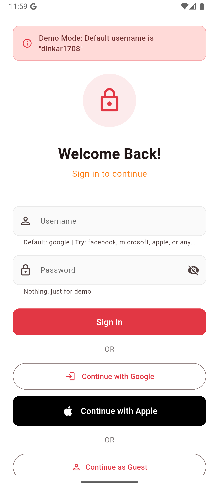
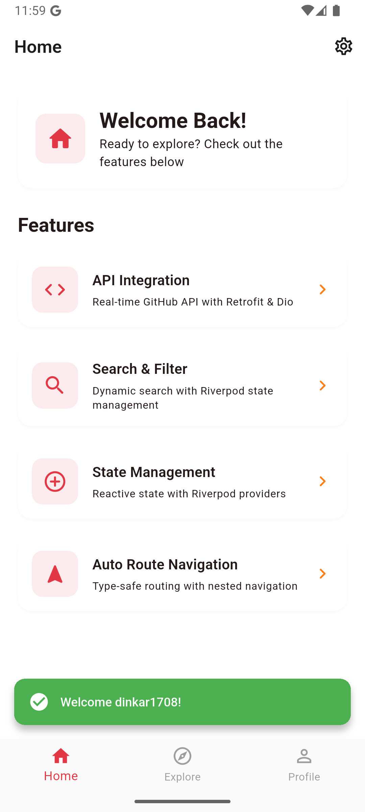
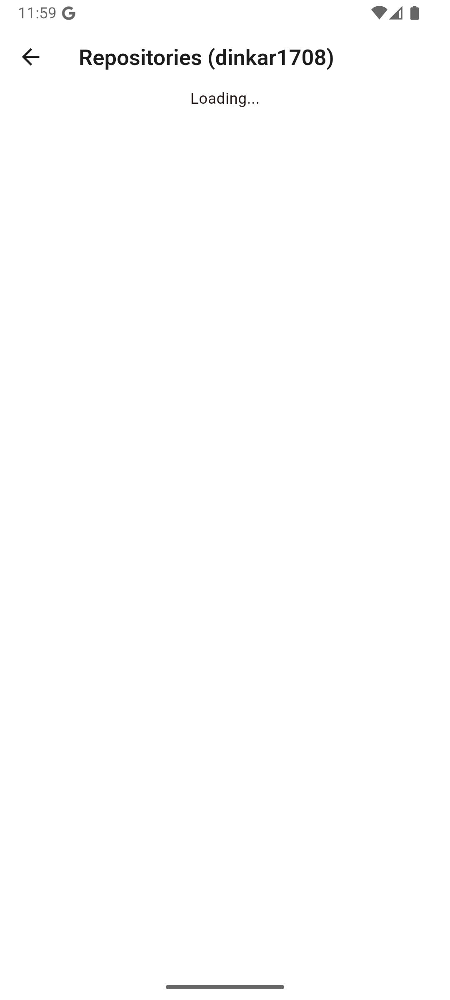
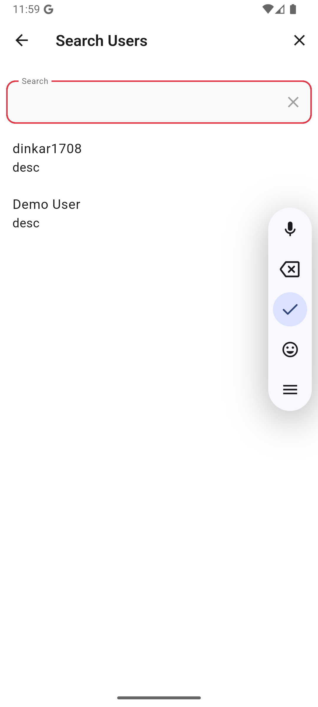
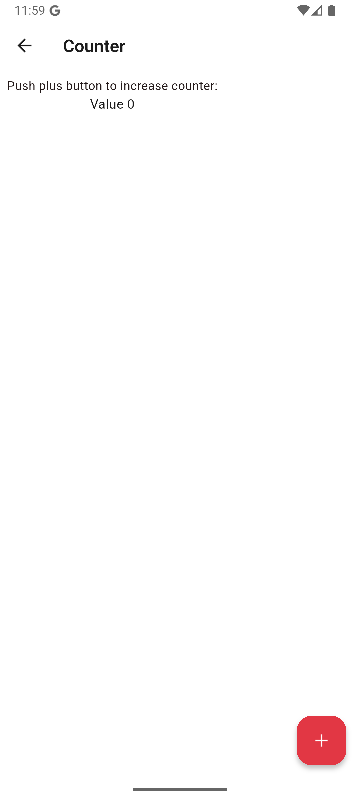
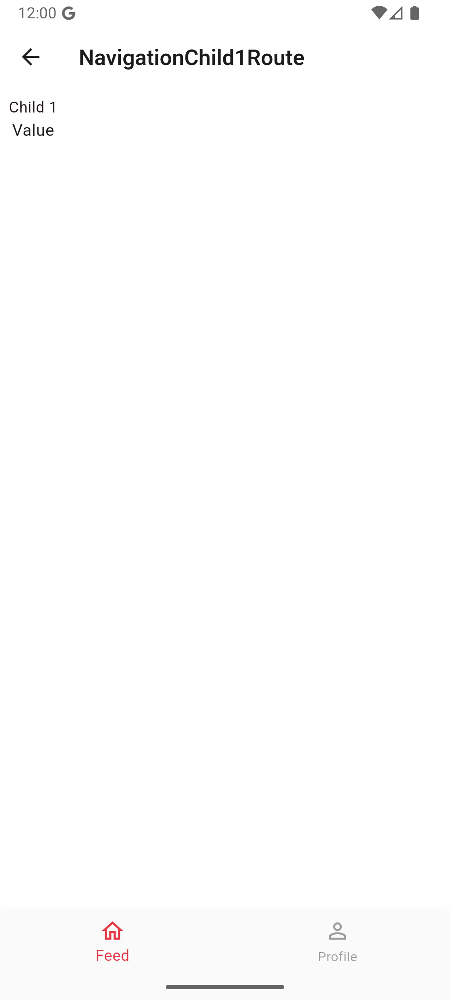
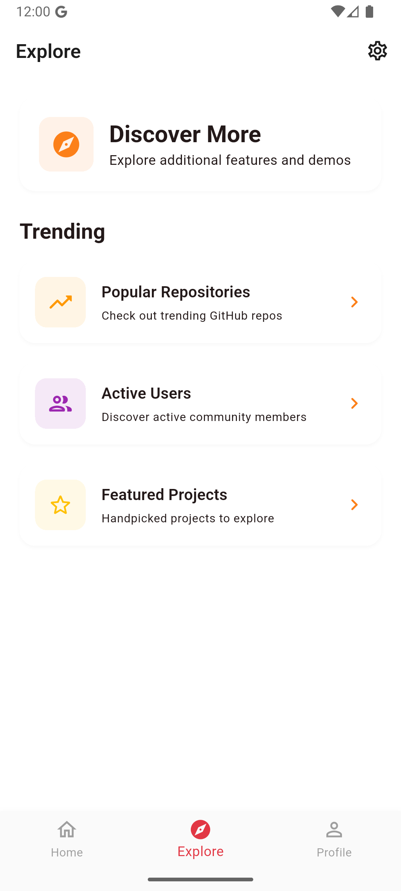
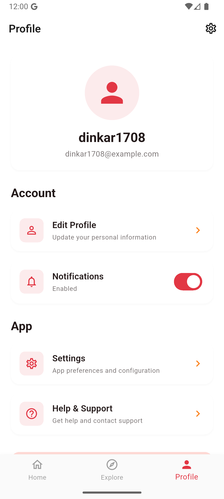
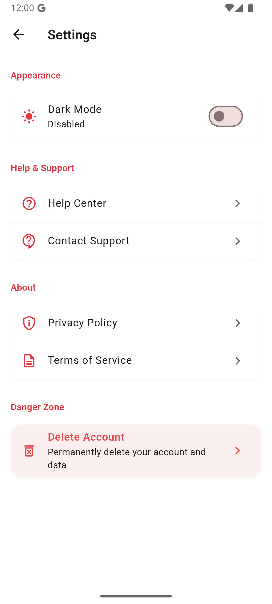

# flutter_riverpod_template

A new Flutter template project using the Riverpod library for state management.

## Table of Contents
1. [Demo](#demo)
2. [User Journeys](#user-journeys)
3. [Setup](#setup)
4. [Guide to Run Code](#guide-to-run-code)
5. [Testing](#testing)
6. [API Used](#api-used-in-the-project)
7. [Features](#features)
8. [Run Configuration Guide](#run-configuration-guide)
9. [Coding Guide](#coding-guide)
10. [Release Guide](#release-guide)
11. [APIs](#apis)
12. [Riverpod Library Guide](#riverpod-library-guide)
13. [FAQ](#faq)
14. [DO/DON'T](#dodont)
15. [TODOs](#todos)

## Demo

Maestro automated test run on the Android emulator (guest onboarding, home features, tabs, explore, and profile):

https://github.com/user-attachments/assets/8186cdb3-1d40-4682-94ca-8678d99daf1e

## User Journeys

**Anyone can read these docs** — no Flutter, Maestro, or Appium setup required. Each journey is a plain step-by-step guide with a verification checklist. Use them to explore the app manually, onboard new teammates, or hand flows to AI testing tools.

**Start here:** [User Journeys index](documentation/USER_JOURNEYS.md)

| # | Journey | What you'll do |
|---|---------|----------------|
| 1 | [Guest onboarding](documentation/journeys/01-guest-onboarding.md) | Open the app and continue as guest to reach the home dashboard |
| 2 | [Home features tour](documentation/journeys/02-home-features-tour.md) | Tap each home feature card and return to the dashboard |
| 3 | [Bottom tabs round trip](documentation/journeys/03-bottom-tabs.md) | Switch between Home, Explore, and Profile tabs |
| 4 | [Explore discovery](documentation/journeys/04-explore-discovery.md) | Browse trending items and open detail screens from Explore |
| 5 | [Profile & settings](documentation/journeys/05-profile-settings.md) | Review profile options and open settings from Home and Profile |

Each doc also links to its matching Maestro and Appium automated tests for developers who want to run them.

## Setup

### Prerequisites
- Flutter SDK installed - Current tested flutter SDK 3.19.6
- Android Studio / VS Code installed
- Emulator / Simulator / Physical device for testing

### Installation
- Clone project
- Run `flutter pub get`
- Generating Code - To generate the necessary code, use the following commands:

***One-time generation:***
```bash
dart run build_runner build --delete-conflicting-outputs
```

***Continuous watch:***
```bash
dart run build_runner watch --delete-conflicting-outputs
```

## Guide to Run Code

### Run configuration configuration using .launch.json file
### Mock data
- Guide: [Mocking Providers](https://riverpod.dev/docs/essentials/testing#mocking-providers)
- Use mock run configuration to use mock/hard-coded data TODO
- Use actual configuration run actual API data

## Testing

### Quick Start
Run all tests:
```bash
flutter test
```

Run specific test file:
```bash
flutter test test/login_page_test.dart
```

### Test Documentation
For detailed testing guide, including:
- Test cases and descriptions
- Coverage information
- Writing new tests
- Best practices

Please refer to: [Testing Guide](documentation/TESTING.md)

## Final after running the app
- Test iOS device of all configurations dev and prod
- 

- Same as iOS Test for Android device

## API Used in the project

### GitHub API:
- Base URL: `https://api.github.com/`

#### Repositories by User Name
1. **Users:**
   - User Repositories: `https://api.github.com/users/:username/repos`
- Endpoint: `users/dinkar1708/repos?per_page=3`

## Screenshots

Captured automatically via Maestro on the Android emulator (`maestro test maestro/screenshots/capture_app_screenshots.yaml`).

| Screen | Preview |
|--------|---------|
| Login |  |
| Home |  |
| Repositories |  |
| Search Users |  |
| Counter |  |
| Navigation |  |
| Explore |  |
| Profile |  |
| Settings |  |

## Features

### Home Page
- Navigation to feature pages
- 


### Feature: Navigation
- [Auto Route](https://github.com/Milad-Akarie/auto_route_library?tab=readme-ov-file#tab-navigation)
- 

### Feature: Counter without API

**API-TYPE: No API**

**Requirement: Maintain widget local state only without network operation**

**How to Use Riverpod in This Case:** Use flutter hooks HookWidget widget

1. Define parent class:

```dart
// see parent class

@RoutePage()
class CounterPage extends HookWidget {
```

2. Use notifier provider on UI

```dart
// define
    final counterState = useState(0);
// use variable
 Text(
              'Value ${counterState.value}',
              style: AppTextStyle.labelMedium
                  .copyWith(color: context.color.textPrimary),
            ),
// modify variable
 onPressed: () {
          counterState.value = counterState.value + 1;
        },
```
- 


### Feature: User GitHub Repository List

**API-TYPE: GET**

**Requirement: Fetch Data from Network**

**How to Use Riverpod in This Case:** User Future Provider - https://riverpod.dev/docs/providers/future_provider

1. Define a future and perform a network call:

```dart
@riverpod
class RepositoryListNotifier extends _$RepositoryListNotifier {
// below is the future provider
  @override
  Future<List<RepositoryListModel>> build() async => await ref
      .read(userRepositoryProvider)
      .getRepositories(userName, pageSize);
}
```

2. Define parent class:

```dart
// see parent class 
class RepositoryListPage extends ConsumerStatefulWidget {
````

3. Use notifier provider on UI

```dart
final repositoryListAsync = ref.watch(repositoryListNotifierProvider);
return switch (repositoryListAsync) {
  AsyncError(:final error) =>
    SliverToBoxAdapter(child: Text('Error $error')),
  AsyncData(:final value) => _buildListView(value),
  _ => const SliverToBoxAdapter(child: Center(child: Text('Loading...'))),
};
```
- 


### Feature: Search Users and Handle widget local state

**API-TYPE: GET**

**Requirement: Fetch Data from Network and handle widget local state(clear button in search box)**

**How to Use Riverpod in This Case:** User Future Provider with hooks - https://riverpod.dev/docs/essentials/side_effects#going-further-showing-a-spinner--error-handling

1. Define a future and perform a network call:

```dart
// TODO later
```

2. Define parent class:

```dart
// see parent class is StatefulHookConsumerWidget which is special using via 'hooks_riverpod' library
// task 1 can use useState     final isSearchingNotifier = useState(false);

// task 2 can do read and watch -     final usersListAsync = ref.watch(usersNotifierProviderProvider);

class UsersPage extends StatefulHookConsumerWidget {
````

3. Use notifier provider on UI

// use widget local state variable
```dart
final isSearchingNotifier = useState(false);
// Change the value
        onChanged: (value) {
          isSearchingNotifier.value = true;
        },
```

```dart
// load user list data
    final usersListAsync = ref.watch(usersNotifierProviderProvider);
    return switch (usersListAsync) {
      AsyncError(:final error) => SliverToBoxAdapter(
          child: SliverToBoxAdapter(child: Text('Error $error'))),
      AsyncData(:final value) => _buildListView(value),
      _ => const SliverToBoxAdapter(child: Center(child: Text('Loading...'))),
    };
```
- 


### Feature: Login

**API-TYPE: POST**

**Requirement: Send data to network**

**How to Use Riverpod in This Case:**

To use the Flutter Future Notifier Provider, we can follow the guidelines provided in the Riverpod documentation. For a more comprehensive guide on handling side effects, such as showing a spinner and error handling, refer to [this section](https://riverpod.dev/docs/essentials/side_effects#going-further-showing-a-spinner--error-handling) of the Riverpod documentation. 
However, for simplicity and to maintain clean code, you can handle error messages and loading states using the [FutureProvider](https://riverpod.dev/docs/providers/future_provider) in Riverpod.

1. Define a future and perform a network call:

```dart
@riverpod
class LoginNotifier extends _$LoginNotifier {
  @override
  Future<LoginStateModel> build() async {
    debugPrint('login initial state....');
    return Future.value(const LoginStateModel());
  }
```

2. Define parent class:

```dart
// see parent class 
class LoginPage extends ConsumerStatefulWidget {

````

3. Use notifier provider on UI
// use to handle progress indicator
```dart
    // watch all the times
    final loginState = ref.watch(loginNotifierProvider);
    // use on UI with condition
          child: loginState.value?.apiResultState == APIResultState.loading
          ? const CircularProgressIndicator()
          : const Text('Login'),
```

// use to show error message
```dart
      // use error message on UI
        const SizedBox(
          height: 100,
        ),
        if (loginState.value?.errorMessage != null)
          Text(loginState.value!.errorMessage),
```

// use to do network request
```dart
// call api and handle error such as snack bar or alert etc.
         loginNotifier.login(loginRequestModel).then((loginStateModel) => {
              if (loginStateModel.apiResultState == APIResultState.result &&
                  loginStateModel.loginResponseModel != null)
                {
                  showSnackBar(context,
                      'Login success ${loginStateModel.loginResponseModel!.userName}'),
                  context.router.replaceAll([HomeRoute(title: 'Home')]),
                }
              else
                {
                  // show error message as snack bar or dailog anything
                  showSnackBar(
                      context, 'Login failed ${loginStateModel.errorMessage}'),
                }
            });

```

**Loading State after the button is clicked**
- 

**Loaded State after the API call is done**
- 


### Feature TODO: Complex Widget local state

**API-TYPE: No api**

**Requirement: Manage complext widget local state**

**How to Use Riverpod in This Case:** State notifier provider https://riverpod.dev/docs/providers/state_notifier_provider
1. Define state model class
StateModel {

}

2. Define a state notifier and define initial state:

```dart
@riverpod
class ABCNotifier extends _$ABCNotifier {
  @override
  // note here not using future
  StateModel build() async {
    return StateModel();
  }
```

3. Use notifier provider on UI

```dart
//
```

### Feature TODO: Combination of POST, GET, or Widget Local State

Define the parent `StatefulHookConsumerWidget`, which allows you to use `useState` and `ref` to access the provider in the desired manner.

**Examples:**

- **POST + Local State:** Follow the login example, but define the parent `StatefulHookConsumerWidget` to use `useState`.
  
- **POST + GET:** Follow the login example and the repository list example.
  
- **POST + GET + Widget Local State:** Follow the login example, the repository list example, and define the parent as `StatefulHookConsumerWidget` to use `useState`.

# Run Configuration Guide

## Guide link
This section provides guidance on setting up flavors, run configurations, and build modes for iOS.
- [Build Modes](https://docs.flutter.dev/testing/build-modes)
- [Flavors](https://docs.flutter.dev/deployment/flavors)

## Flavors/ Run Configuration and Build Mode Guide
Reference flavors guide - [YouTube Video](https://www.youtube.com/watch?v=GwAnn1auo8o&t=198s)
***Only the "dev" and "prod" environments follow the same steps to create a staging environment if needed. Additionally, update the same code in the main folder. Here, too, in the app_config.dart, add a new variable named staging to the AppEnvironment***

## A. iOS - Add Flavor (Schema) using Xcode

- **Add/Edit Schema:

**
  

- **Change Schema Build Configuration etc.:**
  

- **Manage Schema Page:**
  

- **Configuration:**
  In the image below, all build modes ([Debug, Profile, and Release](https://docs.flutter.dev/testing/build-modes)) have been shown for `dev` and `prod` flavors ([Flavors](https://docs.flutter.dev/deployment/flavors)).
  

- **Fix Main File Path:**
  Go to Runner -> Target -> Build Settings -> All, search for `flutter_target`, specify value for each main file.
  

- **Fix Display App Name:**
  Go to Runner -> Target -> Build Settings -> All, search for `product name`, specify value for each main file.
  

- **Fix Bundle Identifier:**
  Go to Runner -> Signing & Capability -> Build Settings -> All.
  

## B. Android - Add Flavor (Schema)

- Add in build.gradle (app)
  

## C. Use Flavor 

### Run Configuration Setting Using VS Code

Using "dev" and "prod" flavors as examples, with "Debug" and "Release" modes:


# Coding Guide
## Riverpod Guide

For detailed information on how Riverpod is used in this project, please refer to the [Features](#features) section, where each feature is accompanied by a guide based on Riverpod's functionality and requirements.

## App navigation
- follow official documentation [Auto Route](https://pub.dev/packages/auto_route)
- must run Generating Code to generate route

## Package used
**This Flutter project utilizes the following packages:**
- [Riverpod](https://riverpod.dev/docs/introduction/getting_started) - State management
- Retrofit - API call
- Dio - HTTP client
- Build Runner - Code generation
- Freezed - Code generation for models
- Freezed Annotations - Annotations for code generation

## Guide to inspect widget
**Start widget inspection. See below picture**


**Select mode -> Click button 'Toggle select widget mode'. See below picture**


**Select widgets - Explore the widget tree to view details. Refer to the following information about the tree:. See below picture**


**End widget inspection. See below picture**


# Release Guide
**Guide CI/CD For detailed guidance**
refer to: [GitHub Actions Quickstart](https://docs.github.com/en/actions/quickstart)

**Github Actions (CI/CD)**

### First-time User? Follow these steps:

1. Visit [flutter-actions/setup-flutter](https://github.com/flutter-actions/setup-flutter) and copy the provided basic version. Paste it into any file, give it a name, commit, push, and create a pull request. This action will automatically begin running.

2. If you have an extra step, add it to the .yml file:

   ```yaml
   - name: Generate code
     run: dart run build_runner build --delete-conflicting-outputs
   ```

3. Now, check if the automatic CI running has passed.

### How to Use This Repository's .yml File:
- Simply copy and paste the `build.yml` file into your repository under `.github/workflows/build.yml`, ensuring to specify the correct version of the Flutter SDK, and it will automatically start building.

# Riverpod Library Guide
- Main library
```
  flutter_riverpod: ^2.2.0
  riverpod_annotation: ^2.3.3
```

- Use flutter hooks to manage state of variables
```
flutter_hooks
```

- StatefulHookConsumerWidget which offers HookWidget and ConsumerStatefulWidget both features.
```
hooks_riverpod
```

# APIs
For example API usage, refer to the list below:
For example API usage, refer to the [API List](documentation/API_LIST.md).

# FAQ
- Can use the `hooks_riverpod` package, StatefulHookConsumerWidget which offers HookWidget and ConsumerStatefulWidget both features.
- All pages must be suffixed by 'Page' to generate auto router automatically
Example 
Correct - HomePage  // at the end must add Page
Wrong - HomeView, HomeWidget, HomeStatefullWidget

- To resolve compile errors, follow these steps:
1. Ensure that generator dependencies are added to `pubspec.yaml` (retrofit_generator, riverpod_generator).
2. Manually delete generated files (`.g` and `.freezed.dart`) before running the build runner commands.
3. Fix compile issues (except for generated syntax) before running build runner commands again.

# DO/DON'T
1. Use hooks for storing widget local state
-  [Essential Do/Don't](https://riverpod.dev/docs/essentials/do_dont)
-  [About Hooks](https://riverpod.dev/docs/concepts/about_hooks)

# TODOs
- Fix command line run -> `flutter run --flavor development` 
   - Target file "lib/main.dart" not found.
- Run using Android Studio configurations
   - Able to run using Android Studio
- Implement GitHub APIs using different Riverpod library usages