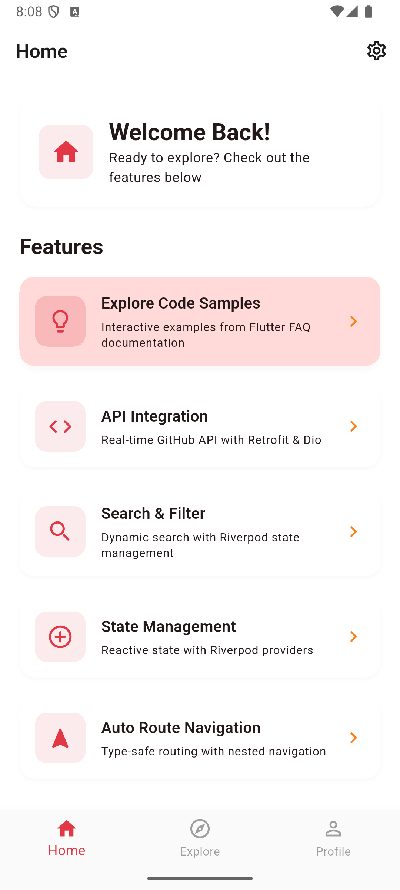
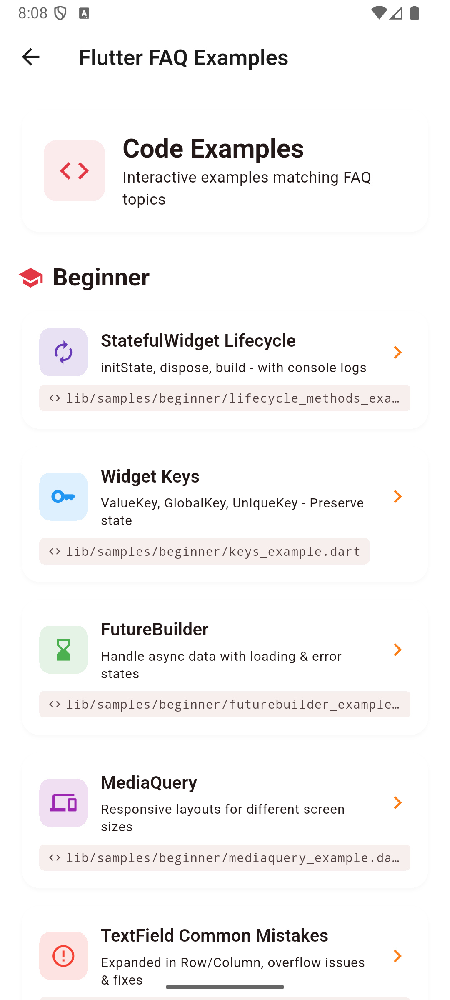

# Flutter Riverpod Template

A production-ready Flutter template using Riverpod 3.0, Clean Architecture, and comprehensive testing.

## Quick Start

### Prerequisites
- Flutter SDK 3.44.1 or higher
- iOS 12+ or Android API 21+

### Installation

```bash
# Clone and run
git clone <your-repo>
cd flutter_riverpod_template
cp .env.example .env.dev
flutter pub get && dart run build_runner build && flutter run -t lib/main/main_dev.dart

# After changing .env files, run full clean:
flutter clean && flutter pub get && dart run build_runner build
```

For detailed setup instructions, see [Environment Setup Guide](docs/technical/ENVIRONMENT_SETUP.md).

## Features

- **State Management**: Riverpod 3.0 with code generation
- **Architecture**: Clean Architecture, feature-based
- **Security**: envied obfuscation, secure storage, token refresh
- **UI**: Material3 with dark mode
- **Testing**: Unit, widget, E2E (Maestro + Appium)
- **Environment**: Obfuscated variables with envied

## Screenshots

<p align="center">
  
  
</p>

## Learning Resources & Training

This template includes comprehensive training materials for Flutter developers of all levels.

**Training Sample Examples:** [lib/samples/](lib/samples/)
- 15+ standalone, runnable examples covering beginner to advanced topics
- Examples include lifecycle methods, state management, animations, isolates, memory leak prevention, and ANR handling
- Each example is fully documented with console logging for learning
- Can be copied to any Flutter project - no dependencies required

**Technical Documentation:** [docs/technical/FAQ/](docs/technical/FAQ/)
- Beginner topics: Widgets, layout, lifecycle, common mistakes
- Intermediate topics: Animations, state management, Riverpod patterns, API integration
- Advanced topics: Isolates, concurrency, platform channels, performance optimization
- All docs cross-reference working code examples from the samples folder

Access samples by tapping "Explore Code Samples" on the home screen.

## Documentation

See [docs/](docs/) for comprehensive guides on architecture, security, testing, and more.

## Running Tests

```bash
# Unit tests
flutter test test/unit/

# Widget tests
flutter test test/widget/

# All tests with coverage
flutter test --coverage

# E2E tests (Maestro)
maestro test maestro/

# E2E tests (Appium)
cd appium && pytest tests/
```

## Project Structure

```
lib/
├── core/          # Utilities, routing, theme
├── data/          # API clients, storage, repositories
├── feature/       # Feature modules (login, home, etc)
├── samples/       # Interactive training examples (beginner/intermediate/advanced)
└── main/          # App entry points (dev/prod)

docs/
├── technical/
│   └── FAQ/       # Technical documentation and learning guides
└── testing/       # Testing guides

test/              # Unit and widget tests
maestro/           # Maestro E2E tests
appium/            # Appium E2E tests
```

## Development Commands

```bash
# Generate code
dart run build_runner build

# Watch for changes
dart run build_runner watch

# Analyze code
flutter analyze

# Format code
dart format .

# Run dev
flutter run -t lib/main/main_dev.dart

# Run prod
flutter run -t lib/main/main_prod.dart

# Build dev APK
flutter build apk --release --flavor dev -t lib/main/main_dev.dart

# Build prod APK
flutter build apk --release --flavor prod -t lib/main/main_prod.dart
```

## Environment Configuration

Uses **envied** with separate files for each environment.

**Development:**
```bash
cp .env.example .env.dev
# Edit .env.dev with dev API keys
flutter clean && flutter pub get && dart run build_runner build
```

**Production:**
```bash
cp .env.example .env.prod
# Edit .env.prod with prod API keys
flutter clean && flutter pub get && dart run build_runner build
```

**Note:** After editing any .env file, always run:
```bash
flutter clean && flutter pub get && dart run build_runner build
```

## Contributing

See documentation for:
- [Architecture Best Practices](docs/technical/ARCHITECTURE.md)
- [Testing Guidelines](docs/testing/UNIT_TESTING_GUIDE.md)
- [Code Style Guide](docs/technical/CODE_STYLE.md)

## Tech Stack

- **Framework**: Flutter 3.44.1
- **State Management**: Riverpod 3.0+ with code generation
- **Architecture**: Clean Architecture, feature-based
- **API Client**: Dio + Retrofit
- **Navigation**: AutoRoute
- **Storage**: flutter_secure_storage
- **Testing**: flutter_test, Maestro, Appium

## License

MIT License - see LICENSE file

## Support

- Documentation: [docs/README.md](docs/README.md)
- Issues: GitHub Issues
- Questions: GitHub Discussions
