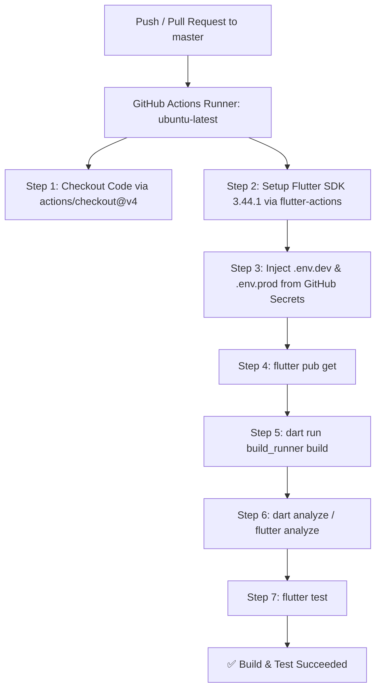

# CI/CD Pipeline & GitHub Actions Guide

> **Official Flutter Documentation:**
> - [Flutter Docs: Continuous Delivery & Deployment](https://docs.flutter.dev/deployment/cd)
> - [GitHub Actions Documentation](https://docs.github.com/en/actions)

---

## Overview

This document explains the Continuous Integration & Continuous Delivery (CI/CD) setup for the **Flutter Riverpod Template** repository. The automated pipeline ensures code quality, validates builds, runs tests, and enforces security standards on every commit and pull request.

The primary workflow configuration is located at:
📄 **[.github/workflows/build.yml](file:///.github/workflows/build.yml)**

---

## Workflow Architecture



---

## Step-by-Step Pipeline Breakdown

### 1. Trigger Conditions
Configured in [.github/workflows/build.yml](file:///.github/workflows/build.yml):
```yaml
on:
  push:
    branches: [ master ]
  pull_request:
    branches: [ master ]
```
* **Pull Requests:** Validates that incoming pull requests pass linting, code generation, and unit tests before merging.
* **Direct Pushes to master:** Ensures the latest `master` branch is in a stable, passing state.

---

### 2. Environment & Secrets Injection
Because [.env.dev](file:///Users/dinakarmaurya/Documents/Personal/flutter_riverpod_template/.env.dev) and [.env.prod](file:///Users/dinakarmaurya/Documents/Personal/flutter_riverpod_template/.env.prod) are git-ignored for security, the CI runner constructs them dynamically before code generation:

```yaml
- name: Create environment files
  run: |
    cat > .env.dev <<EOF
    API_BASE_URL=https://api.github.com/
    API_KEY=${{ secrets.DEV_API_KEY || 'dummy_dev_api_key_for_ci' }}
    ENVIRONMENT=dev
    GOOGLE_MAPS_API_KEY=${{ secrets.DEV_MAPS_API_KEY || 'dummy_dev_maps_key_for_ci' }}
    EOF
    cat > .env.prod <<EOF
    API_BASE_URL=https://api.github.com/
    API_KEY=${{ secrets.PROD_API_KEY || 'dummy_prod_api_key_for_ci' }}
    ENVIRONMENT=prod
    GOOGLE_MAPS_API_KEY=${{ secrets.PROD_MAPS_API_KEY || 'dummy_prod_maps_key_for_ci' }}
    EOF
```

> [!TIP]
> **Production Setup:** Add `DEV_API_KEY`, `PROD_API_KEY`, and `MAPS_API_KEY` into your GitHub Repository under **Settings ➔ Secrets and variables ➔ Actions**.

---

### 3. Dependency Resolution & Code Generation
```yaml
- name: Install dependencies
  run: flutter pub get

- name: Generate code
  run: dart run build_runner build --delete-conflicting-outputs
```
* Generates `env.g.dart` (obfuscated keys via `envied`), `api_client.g.dart` (Retrofit), `app_router.gr.dart` (AutoRoute), and Riverpod providers.

---

### 4. Static Analysis & Testing
```yaml
- name: Analyze project source
  run: dart analyze

- name: Run tests
  run: flutter test
```
* Enforces lint rules defined in [analysis_options.yaml](file:///Users/dinakarmaurya/Documents/Personal/flutter_riverpod_template/analysis_options.yaml).
* Runs all unit, provider, and widget test suites.

---

## Frequently Asked Questions (CI/CD FAQ)

### Q1: How do you handle `.env` and sensitive API keys in Flutter CI/CD pipelines?
**Answer:**
1. **Never commit `.env` files** to Git (ensure `.env*` is in `.gitignore`).
2. Store secrets in **GitHub Secrets** (or Vault / AWS Secrets Manager).
3. In CI, write a script step to inject secrets into the expected `.env` file before `build_runner` or Gradle runs.
4. Use `envied` with `obfuscate: true` so compiled binaries do not store plaintext secrets.

---

### Q2: Why does `build_runner` need to execute on CI/CD?
**Answer:**
Generated files (e.g., `*.g.dart`, `*.freezed.dart`, `env.g.dart`) should either be kept up-to-date or generated fresh during CI. Running `build_runner` in CI ensures:
* Generated code matches the current model definitions.
* Environment variables from CI secrets are embedded into `env.g.dart`.
* No obsolete generated code gets built or tested.

---

### Q3: How do you optimize Flutter CI/CD pipeline runtime?
**Answer:**
1. **Dependency & Pub Cache:**
   ```yaml
   - name: Cache pub dependencies
     uses: actions/cache@v4
     with:
       path: ~/.pub-cache
       key: ${{ runner.os }}-pub-${{ hashFiles('**/pubspec.lock') }}
       restore-keys: |
         ${{ runner.os }}-pub-
   ```
2. **Matrix Builds:** Split static analysis and unit tests to run in parallel.
3. **Use Ubuntu for Unit Tests:** Run test and analysis jobs on `ubuntu-latest` (fastest & cheapest compute). Only use `macos-latest` when building iOS IPAs.

---

### Q4: When is `macos-latest` required instead of `ubuntu-latest`?
**Answer:**
* **`ubuntu-latest`:** Ideal for `flutter analyze`, `flutter test`, and building Android APKs/AABs.
* **`macos-latest`:** Strictly required for building iOS (`.ipa`), running Xcode tools (`xcodebuild`), CocoaPods (`pod install`), and running iOS simulators.

---

### Q5: How do you export Android artifacts in GitHub Actions?
**Answer:**
Add an artifact upload step after the build:
```yaml
- name: Build Android Dev APK
  run: flutter build apk --flavor dev -t lib/main/main_dev.dart

- name: Upload APK Artifact
  uses: actions/upload-artifact@v4
  with:
    name: app-dev-debug
    path: build/app/outputs/flutter-apk/app-dev-debug.apk
```

---

## Related Documentation & Workflows
- Workflow Configuration: [.github/workflows/build.yml](file:///.github/workflows/build.yml)
- [Environment Setup](ENVIRONMENT_SETUP.md)
- [Security Guide](SECURITY.md)
- [Android Release Guide](../build/android/prod_apk_export.md)
- [iOS Release Guide](../build/ios/ios_build_guide.md)
