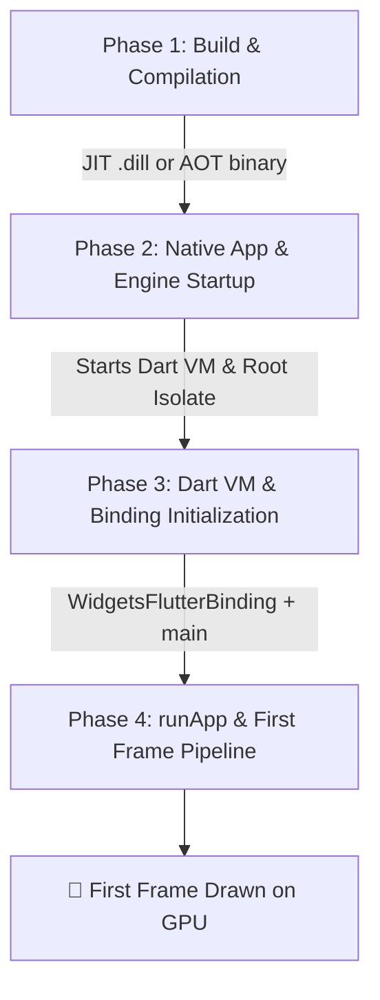
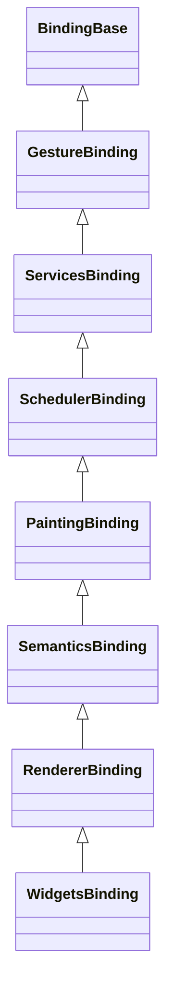
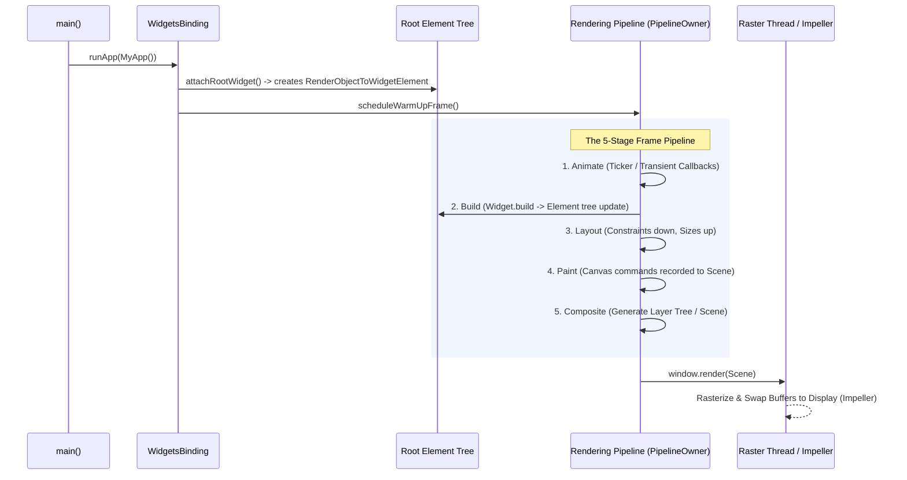

# Flutter App Launch & Rendering Lifecycle

> **Official Flutter Documentation:**
> - [Flutter Architectural Overview](https://docs.flutter.dev/resources/architectural-overview)
> - [Flutter API Reference: `WidgetsFlutterBinding` class](https://api.flutter.dev/flutter/widgets/WidgetsFlutterBinding-class.html)
> - [Flutter API Reference: `runApp` function](https://api.flutter.dev/flutter/widgets/runApp.html)

---

## Executive Summary

When launching a Flutter app (from clicking "Run" or tapping the app icon to pixels appearing on screen), execution moves across four distinct architectural phases:



---

## Phase 1: Build & Compilation (Host Machine)

### Debug Mode (JIT) vs Release Mode (AOT)

| Feature | Debug Mode (JIT) | Release Mode (AOT) |
| :--- | :--- | :--- |
| **Compilation** | Dart source ➔ Kernel AST (`.dill` file) | Dart source ➔ Machine code (`libapp.so` / `App.framework`) |
| **Dart VM Execution** | JIT with runtime profiler | Precompiled native assembly (No JIT compiler) |
| **Hot Reload** | **Enabled** (injects updated `.dill` deltas) | **Disabled** (stripped for speed and binary size) |
| **Performance** | Slower startup, unoptimized code | High-speed cold start, full compiler optimizations |

---

## Phase 2: Native App Launch & Engine Startup

1. **Native OS Entry Point**:
   * **Android**: `FlutterActivity` (`MainActivity.kt`) initializes `FlutterEngine` and attaches `FlutterView`.
   * **iOS**: `FlutterAppDelegate` (`AppDelegate.swift`) boots `FlutterEngine` and configures `FlutterViewController`.
2. **C++ Flutter Engine Startup**:
   * Initializes the graphics backend (**Impeller** on Metal/Vulkan or Skia).
   * Spawns core engine threads: **Platform Thread**, **UI Thread** (Dart VM), and **Raster Thread** (GPU drawing).
   * Embeds asset bundles (`AssetManifest.json`, fonts, compiled Dart snapshot).

---

## Phase 3: Dart VM & Binding Initialization

### 1. Root Isolate Creation
The Flutter engine creates the **Main UI Isolate** and loads the Dart entry point.

### 2. `WidgetsFlutterBinding.ensureInitialized()`
Instantiates the single `WidgetsBinding` singleton which mixes in the **7 core engine services**:



* **`GestureBinding`**: Connects low-level pointer events from the engine to gesture recognizers.
* **`ServicesBinding`**: Manages `MethodChannel` and message communication between Dart and native layers.
* **`SchedulerBinding`**: Manages frame callbacks (`scheduleFrame()`, `addPostFrameCallback()`).
* **`PaintingBinding`**: Manages the canvas painting subsystem and image cache.
* **`SemanticsBinding`**: Bridges the accessibility tree to native assistive technology.
* **`RendererBinding`**: Manages the `RenderObject` tree and layout/paint scheduling.
* **`WidgetsBinding`**: Connects the `Widget` / `Element` tree with the rendering layer.

---

## Phase 4: `runApp()` & First Frame Pipeline

When `runApp(Widget app)` executes:

```dart
void runApp(Widget app) {
  final WidgetsBinding binding = WidgetsFlutterBinding.ensureInitialized();
  binding.attachRootWidget(binding.wrapWithDefaultStyles(app));
  binding.scheduleWarmUpFrame();
}
```



---

## Cold Start Performance Optimization Checklist

1. **Avoid Heavy Synchronous Work in `main()`**:
   * Run initializations in parallel using `Future.wait([initA(), initB()])`.
   * Defer non-critical SDKs (analytics, secondary services) until after the first frame via `WidgetsBinding.instance.addPostFrameCallback`.
2. **Use Precompiled Shaders (Impeller)**:
   * Impeller eliminates shader compilation jank on iOS and modern Android devices by precompiling shaders at engine build time.
3. **Optimize Asset Manifest**:
   * Avoid bundling unused high-resolution images in `pubspec.yaml` that increase startup asset parsing time.
4. **Use Const Constructors**:
   * Allows the Dart compiler to allocate widget configurations into static memory during compilation.

---

## Related Documentation
- [The Three Trees (Widget, Element, RenderObject)](../beginner/three_trees.md)
- [Flutter Keys Guide](../beginner/keys.md)
- [Engine & Rendering Internals](engine_and_rendering_internals.md)
- [CI/CD Pipeline Guide](../../CI_CD_PIPELINE.md)
