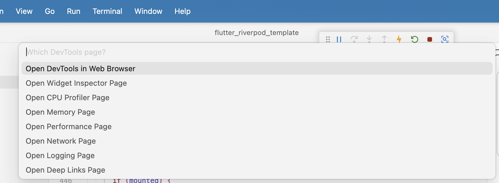

# Advanced Level: Security & Performance Engineering

This guide covers compile-time secret obfuscation, hardware-backed persistence, SSL/TLS certificate pinning, memory leak profiling, and DevTools optimization.

---

## Table of Contents

1. [Compile-Time Secret Obfuscation (`envied`)](#1-compile-time-secret-obfuscation-envied)
2. [Hardware-Backed Persistence (iOS Keychain / Android Keystore)](#2-hardware-backed-persistence-ios-keychain--android-keystore)
3. [SSL/TLS Certificate Pinning & MitM Mitigation](#3-ssltls-certificate-pinning--mitm-mitigation)
4. [Memory Leak Detection & DevTools Snapshot Diffing](#4-memory-leak-detection--devtools-snapshot-diffing)
5. [Flutter DevTools Complete Guide](#4a-flutter-devtools-complete-guide)
6. [`RepaintBoundary` & Layer Isolation](#5-repaintboundary--layer-isolation)
7. [Accessibility (a11y) & Semantics](#6-accessibility-a11y--semantics)
8. [Internationalization (i18n) & Localization](#7-internationalization-i18n--localization)
9. [Flutter Flavors for Multi-Environment Builds](#8-flutter-flavors-for-multi-environment-builds)
10. [App Deployment (Play Store & App Store)](#9-app-deployment-play-store--app-store)

---

## 1. Compile-Time Secret Obfuscation (`envied`)

### Q1: Why is storing API keys in `.env` assets insecure, and how does `envied` solve it?
**Answer:**
- **Plain `.env` assets**: Packaged as raw files inside the APK/IPA bundle and can be read by simply running `unzip app.apk` and inspecting strings.
- **`envied` with `@EnviedField(obfuscate: true)`**: Encrypts secret strings at compile time into an array of bytes using a pseudo-random XOR key. At runtime, the key is decrypted dynamically in memory, preventing reverse-engineering tools (`strings`, `apktool`, `ghidra`) from extracting secrets statically.

```dart
@Envied(path: '.env.prod', obfuscate: true)
abstract class Env {
  @EnviedField(varName: 'API_KEY')
  static final String apiKey = _Env.apiKey;
}
```

---

## 2. Hardware-Backed Persistence (iOS Keychain / Android Keystore)

### Q2: How does `flutter_secure_storage` safeguard credentials?
**Answer:**
- **iOS**: Uses the **iOS Keychain**, protected by the hardware-backed Secure Enclave with accessibility flags (e.g., `first_unlock_this_device`).
- **Android**: Uses **EncryptedSharedPreferences** backed by the **Android Keystore System** with AES-256 GCM encryption.

---

## 3. SSL/TLS Certificate Pinning & MitM Mitigation

### Q3: How do you implement Certificate Pinning in Dio?
**Answer:**
Certificate pinning verifies the server's public key or SHA-256 fingerprint against a hardcoded hash, preventing Man-in-the-Middle (MitM) proxy attacks.

```dart
void setupSslPinning(Dio dio, String expectedFingerprint) {
  dio.httpClientAdapter = IOHttpClientAdapter(
    createHttpClient: () {
      final client = HttpClient(context: SecurityContext(withTrustedRoots: false));
      client.badCertificateCallback = (X509Certificate cert, String host, int port) {
        final fingerprint = sha256.convert(cert.der).toString();
        return fingerprint == expectedFingerprint;
      };
      return client;
    },
  );
}
```

---

## 4. Memory Leak Detection & DevTools Snapshot Diffing

### Q4: How do you identify memory leaks using Flutter DevTools?
**Answer:**
Memory leaks in Flutter are silent killers - they don't throw errors but consume memory until the app crashes. Use Flutter DevTools to detect them.

**Live Interactive Example:** [lib/samples/intermediate/memory_leak_example.dart](../../../../lib/samples/intermediate/memory_leak_example.dart)

**Step-by-Step Detection Process:**

1. **Run app in Profile Mode** (Debug mode has memory overhead)
   ```bash
   flutter run --profile
   ```

2. **Open Flutter DevTools Memory Tab**
   - Click the DevTools link in terminal, or
   - Visit `http://localhost:9100` in browser
   - Navigate to Memory tab

3. **Capture Baseline Snapshot**
   - Click "Snapshot" button
   - Note the current memory usage

4. **Perform User Journey**
   - Navigate to a page (e.g., open TextEditingController example)
   - Navigate back to home
   - Repeat 5-10 times to amplify the leak

5. **Trigger Garbage Collection**
   - Click "GC" button (trash icon) in DevTools
   - Wait 2-3 seconds for GC to complete

6. **Take Second Snapshot**
   - Click "Snapshot" button again
   - Click "Diff" to compare with baseline

7. **Analyze Leaked Objects**
   - Look for growing instances of:
     - `TextEditingController` (should be 0 after disposal)
     - `_TimerImpl` (from uncancelled timers)
     - `StreamSubscription` (from uncancelled streams)
     - Your `State` objects (e.g., `_ProfilePageState`)
   - Click on leaked object → View "Retaining Path"
   - Follow the path to find what's holding the reference

**Common Memory Leak Patterns:**

| Leak Type | What to Look For | Fix |
|-----------|-----------------|-----|
| **TextEditingController** | Instances remain after navigation | Add `dispose()` method |
| **Timer/Stream** | Timer keeps ticking after pop | Call `timer.cancel()` in dispose |
| **setState after dispose** | Error in console | Check `mounted` before setState |
| **Event listeners** | Listeners not removed | Remove in dispose() |

**Red Flags in DevTools:**
- Memory graph keeps climbing (never drops)
- Same object count grows with each navigation cycle
- Heap size doesn't decrease after GC
- "Retaining Path" shows unexpected references

**Pro Tips:**
- Always test navigation cycles (open → close) 5-10 times
- Use DevTools Timeline to track frame drops caused by memory pressure
- Profile mode gives accurate memory metrics (Debug mode inflates numbers)
- Watch for "Platform Channel" leaks (native resources not freed)

**Real Console Output from Memory Leak Examples:**

*The following logs are actual output captured from running the examples on a real Android device. These demonstrate exactly what you'll see in your console when memory leaks occur.*

**Leak 1: TextEditingController Not Disposed (SILENT - No Error!)**
```
🔴 Opening WRONG example - will cause memory leak
🔴 [LEAK] TextEditingController created - ID: 324656447
⚠️ [LEAK] This controller will NEVER be disposed!
[User navigates back]
⚠️ [LEAK] Widget is being removed but controller is NOT disposed!
💀 [LEAK] Controller 324656447 will stay in memory FOREVER!
```
**Notice:** No error thrown! Controller just stays in memory consuming resources.

**Leak 1 FIXED: Properly Disposed**
```
✅ Opening RIGHT example - properly disposes
✅ [GOOD] TextEditingController created - ID: 416208355
[User navigates back]
✅ [GOOD] Disposing TextEditingController - ID: 416208355
```

---

**Leak 2: Timer Not Cancelled (SILENT - Keeps Running!)**
```
🔴 Opening WRONG example - timer never stops
🔴 [LEAK] Starting timer that will NEVER stop!
🔴 [LEAK] Timer tick #1 - Counter: 0 (Widget might be disposed!)
🔴 [LEAK] Timer tick #2 - Counter: 1 (Widget might be disposed!)
[User navigates back]
⚠️ [LEAK] Widget is being removed but timer is STILL RUNNING!
💀 [LEAK] Timer will continue ticking in the background FOREVER!
💀 [LEAK] Watch the console - timer will keep printing even after widget is gone!
🔴 [LEAK] Timer tick #3 - Counter: 2 (Widget might be disposed!)  ← Widget is GONE!
🔴 [LEAK] Timer tick #4 - Counter: 2 (Widget might be disposed!)
🔴 [LEAK] Timer tick #5 - Counter: 2 (Widget might be disposed!)
🔴 [LEAK] Timer tick #6 - Counter: 2 (Widget might be disposed!)
... continues forever ...
```
**Notice:** Timer keeps running even after widget is removed! This is a memory leak.

---

**Leak 3: setState After Dispose (THROWS ERROR!)**
```
🔴 Opening WRONG example - setState after dispose
🔴 [LEAK] Starting async task...
[User navigates back before async task completes]
⚠️ [LEAK] Widget disposed but async task is still running!
⚠️ [LEAK] When task completes, setState will be called on disposed widget!
[3 seconds later...]
🔴 [LEAK] Async task done, calling setState (might be disposed!)
💀 [ERROR] setState FAILED! Widget was disposed!
💀 [ERROR] setState() called after dispose(): _SetStateAfterDisposeExampleState#638ef
         (lifecycle state: defunct, not mounted)

This error happens if you call setState() on a State object for a widget
that no longer appears in the widget tree (e.g., whose parent widget no
longer includes the widget in its build). This error can occur when code
calls setState() from a timer or an animation callback.

The preferred solution is to cancel the timer or stop listening to the
animation in the dispose() callback. Another solution is to check the
"mounted" property of this object before calling setState() to ensure
the object is still in the tree.

This error might indicate a memory leak if setState() is being called
because another object is retaining a reference to this State object
after it has been removed from the tree. To avoid memory leaks, consider
breaking the reference to this object during dispose().
```
**Notice:** This one DOES throw an error! Flutter warns about the leak.

---

**Key Takeaway:**
Out of 6 common memory leak patterns, only **setState after dispose** throws a visible error!

**5 out of 6 leaks are SILENT:**
1. TextEditingController ❌ Silent
2. Timer ❌ Silent
3. StreamSubscription ❌ Silent
4. Listener ❌ Silent
5. FocusNode ❌ Silent
6. setState after dispose ✅ Throws error

You won't know about silent leaks until the app crashes from OOM (Out of Memory)!

**This is why DevTools Memory profiling is critical** - it's the only way to detect silent leaks before production.

---

**Leak 4: StreamSubscription Not Cancelled (SILENT - Keeps Running!)**
```
🔴 Opening WRONG example - stream never cancelled
🔴 [LEAK] Creating stream subscription
⚠️ [LEAK] Subscription created but will NEVER be cancelled!
🔴 [LEAK] Stream event received: 0 (Widget might be disposed!)
🔴 [LEAK] Stream event received: 1 (Widget might be disposed!)
🔴 [LEAK] Stream event received: 2 (Widget might be disposed!)
🔴 [LEAK] Stream event received: 3 (Widget might be disposed!)
[User navigates back]
⚠️ [LEAK] Widget is being removed but stream is STILL LISTENING!
💀 [LEAK] Stream will continue processing events FOREVER!
🔴 [LEAK] Stream event received: 4 (Widget might be disposed!)
🔴 [LEAK] Stream event received: 5 (Widget might be disposed!)
🔴 [LEAK] Stream event received: 6 (Widget might be disposed!)
... continues forever ...
```
**Notice:** Stream keeps emitting events even after widget is removed! Memory leak + wasted CPU cycles.

---

**Leak 5: Listener Not Removed (SILENT - Keeps State in Memory!)**
```
🔴 Opening WRONG example - listener not removed
🔴 [LEAK] TextEditingController created - ID: 940485227
🔴 [LEAK] Adding listener to controller...
⚠️ [LEAK] Listener added but will NEVER be removed!
🔴 [LEAK] Listener triggered - Text: ""
🔴 [LEAK] Listener triggered - Text: "g"
🔴 [LEAK] Listener triggered - Text: "gg"
[User navigates back]
⚠️ [LEAK] Widget is being removed but listener is STILL ATTACHED!
💀 [LEAK] Listener will keep the State object in memory FOREVER!
```
**Notice:** Listener holds a reference to the State object, preventing garbage collection!

---

**Leak 6: FocusNode Not Disposed (SILENT - No Error!)**
```
🔴 Opening WRONG example - FocusNode not disposed
🔴 [LEAK] FocusNode created - ID: 803954814
⚠️ [LEAK] This FocusNode will NEVER be disposed!
🔴 [LEAK] Focus requested
[User navigates back]
⚠️ [LEAK] Widget is being removed but FocusNode is NOT disposed!
💀 [LEAK] FocusNode 803954814 will stay in memory FOREVER!
```
**Notice:** FocusNode is just like any controller - MUST be disposed!

---

### Memory Leak Patterns by Category

Instead of listing every controller separately, here are the **unique patterns** you need to know:

---

#### Pattern 1: Controllers (All Need `dispose()`)

**Applies to:**
- `TextEditingController`
- `AnimationController`
- `ScrollController`
- `PageController`
- `TabController`
- `VideoPlayerController`
- `TransformationController`
- `FocusNode`

**The Pattern:**
```dart
// ❌ WRONG - Memory Leak
class _MyWidgetState extends State<MyWidget> {
  final _anyController = TextEditingController();  // or AnimationController, ScrollController, etc.

  // ❌ Missing dispose()!
}

// ✅ RIGHT - Always dispose() in dispose()
@override
void dispose() {
  _anyController.dispose();  // ← MUST call for ALL controllers
  super.dispose();
}
```

**Rule:** If it has a `.dispose()` method, you MUST call it in your widget's `dispose()`.

---

#### Pattern 2: Timers (Call `cancel()`)

```dart
// ❌ WRONG - Timer keeps running after widget is disposed
class _MyWidgetState extends State<MyWidget> {
  late Timer _timer;

  @override
  void initState() {
    super.initState();
    _timer = Timer.periodic(Duration(seconds: 1), (timer) {
      setState(() { /* ... */ });
    });
  }

  // ❌ Missing timer.cancel()!
}

// ✅ RIGHT - Cancel in dispose()
@override
void dispose() {
  _timer.cancel();
  super.dispose();
}
```

---

#### Pattern 3: StreamSubscriptions (Call `cancel()`)

```dart
// ❌ WRONG - Stream keeps listening after widget is disposed
class _MyWidgetState extends State<MyWidget> {
  late StreamSubscription _subscription;

  @override
  void initState() {
    super.initState();
    _subscription = someStream.listen((data) {
      setState(() { /* ... */ });
    });
  }

  // ❌ Missing cancel()!
}

// ✅ RIGHT - Cancel in dispose()
@override
void dispose() {
  _subscription.cancel();
  super.dispose();
}
```

---

#### Pattern 4: Listeners (Call `removeListener()`)

```dart
// ❌ WRONG - Listener not removed
class _MyWidgetState extends State<MyWidget> {
  final _controller = TextEditingController();

  @override
  void initState() {
    super.initState();
    _controller.addListener(_onTextChanged);  // ← Added listener
  }

  void _onTextChanged() {
    print('Text: ${_controller.text}');
  }

  // ❌ Missing removeListener()!
}

// ✅ RIGHT - Remove listener before dispose
@override
void dispose() {
  _controller.removeListener(_onTextChanged);  // ← Remove first
  _controller.dispose();                        // ← Then dispose
  super.dispose();
}
```

**Applies to:** `ChangeNotifier`, `ValueNotifier`, `TextEditingController.addListener()`, `AnimationController.addListener()`

---

#### Pattern 5: Platform Channels (Set to `null`)

```dart
// ❌ WRONG - Handler not removed
class _MyWidgetState extends State<MyWidget> {
  static const platform = MethodChannel('com.example/battery');

  @override
  void initState() {
    super.initState();
    platform.setMethodCallHandler(_handleMethod);
  }

  Future<dynamic> _handleMethod(MethodCall call) async { /* ... */ }

  // ❌ Missing cleanup!
}

// ✅ RIGHT - Remove handler in dispose
@override
void dispose() {
  platform.setMethodCallHandler(null);  // ← Set to null
  super.dispose();
}
```

---

#### Pattern 6: Async Callbacks (Check `mounted`)

```dart
// ❌ WRONG - setState after widget is disposed
class _MyWidgetState extends State<MyWidget> {
  void loadData() {
    Future.delayed(Duration(seconds: 3), () {
      setState(() { /* ... */ });  // ❌ Widget might be disposed!
    });
  }
}

// ✅ RIGHT - Check mounted before setState
void loadData() {
  Future.delayed(Duration(seconds: 3), () {
    if (mounted) {  // ✅ Check if still in tree
      setState(() { /* ... */ });
    }
  });
}
```

**Applies to:** Any async operation (`Future`, `async/await`, callbacks) that calls `setState()`

---

### Quick Memory Leak Checklist

When creating a `StatefulWidget`, always ask:

✅ **Pattern 1: Controllers**
- [ ] Do I have any controllers? (TextEditingController, AnimationController, ScrollController, PageController, TabController, VideoPlayerController, TransformationController, FocusNode)
- [ ] Did I call `.dispose()` on ALL of them?

✅ **Pattern 2: Timers**
- [ ] Do I have any `Timer.periodic()` or `Timer()`?
- [ ] Did I call `_timer.cancel()` in dispose()?

✅ **Pattern 3: Streams**
- [ ] Do I have any `StreamSubscription`?
- [ ] Did I call `_subscription.cancel()` in dispose()?

✅ **Pattern 4: Listeners**
- [ ] Did I call `.addListener()` anywhere?
- [ ] Did I call `.removeListener()` in dispose()?

✅ **Pattern 5: Platform Channels**
- [ ] Did I set a `MethodChannel` handler?
- [ ] Did I set it to `null` in dispose()?

✅ **Pattern 6: Async Callbacks**
- [ ] Do I have async operations that call `setState()`?
- [ ] Did I check `if (mounted)` before calling setState()?

✅ **Testing**
- [ ] Did I test navigating back multiple times?
- [ ] Did I verify with DevTools Memory tab?

**Pro Tip:** If object count grows after each navigation cycle in DevTools, you have a leak!

---

## 4a. Flutter DevTools Complete Guide

### Q4a: What are all the Flutter DevTools pages and when should I use each one?
**Answer:**
Flutter DevTools is a powerful suite of debugging and performance tools. Each page serves a specific purpose.

**Screenshot Reference:**


**Access DevTools:**
```bash
# While app is running
flutter run --profile  # Or --debug
# Click the DevTools link in terminal
# Or visit http://localhost:9100
```

### DevTools Pages Overview

#### 1. Widget Inspector Page
**When to Use:**
- Debugging layout issues (overflow, alignment, spacing)
- Understanding widget tree structure
- Finding which widget is causing rendering problems
- Inspecting widget properties in real-time

**Key Features:**
- Visual widget tree hierarchy
- Select widget from screen mode
- Layout explorer (see padding, margins, constraints)
- Widget details panel (all properties visible)

**Common Use Cases:**
```
✅ "Why is my button not aligned properly?" → Use Select Widget mode
✅ "Which widget is causing overflow?" → Check Layout Explorer
✅ "What's the actual size of this container?" → Inspect widget properties
```

**Pro Tip:** Enable "Show Guidelines" to see widget boundaries on screen

---

#### 2. CPU Profiler Page
**When to Use:**
- App feels laggy or jank
- Investigating slow frame rendering
- Finding CPU-intensive operations
- Identifying synchronous blocking code on UI thread

**Key Features:**
- Flame chart showing method call stack
- Frame rendering timeline
- CPU usage per method
- Identify expensive operations

**Common Use Cases:**
```
✅ "Why is my list scrolling slowly?" → Profile scroll performance
✅ "Which function is taking too long?" → Check flame chart
✅ "Is my code blocking the UI thread?" → Look for long synchronous calls
```

**Red Flags:**
- Methods taking >16ms (causes frame drops at 60fps)
- Deep call stacks (suggests inefficient algorithms)
- Heavy computation on build() method

---

#### 3. Memory Page
**When to Use:**
- Detecting memory leaks
- App crashes with OOM (Out of Memory)
- Memory usage growing unexpectedly
- After navigation cycles to check for leaks

**Key Features:**
- Heap snapshots
- Memory timeline graph
- Snapshot diff (compare before/after)
- Retaining path analysis
- Garbage Collection trigger

**Common Use Cases:**
```
✅ "Is my app leaking memory?" → Take snapshots before/after navigation
✅ "Why does memory keep growing?" → Check for undisposed controllers
✅ "What's holding this object?" → View retaining path
```

**How to Use:**
1. Take snapshot before action
2. Perform action (navigate, load data, etc.)
3. Navigate back
4. Trigger GC
5. Take second snapshot
6. Click "Diff" to compare

**See detailed guide:** [Memory Leak Detection](#4-memory-leak-detection--devtools-snapshot-diffing)

---

#### 4. Performance Page (Timeline)
**When to Use:**
- Diagnosing UI jank (dropped frames)
- Finding expensive rebuilds
- Analyzing animation performance
- Investigating GPU/rasterization issues

**Key Features:**
- Frame rendering timeline
- UI thread vs Raster thread analysis
- Shader compilation tracking
- Frame times (60fps = 16ms per frame)

**Common Use Cases:**
```
✅ "Why are frames dropping during animation?" → Check frame timeline
✅ "Is the problem UI or raster thread?" → Compare thread activity
✅ "Shader jank on first run?" → Track shader compilation
```

**Performance Metrics:**
- Green bars = Good (under 16ms)
- Yellow/Red bars = Janky (over 16ms)
- Raster thread issues = GPU/drawing problems
- UI thread issues = Dart code problems

---

#### 5. Network Page
**When to Use:**
- Debugging API calls
- Inspecting HTTP requests/responses
- Finding slow network requests
- Checking request headers/bodies

**Key Features:**
- All HTTP requests listed
- Request/response details
- Timing information
- WebSocket monitoring

**Common Use Cases:**
```
✅ "Is my API call failing?" → Check status codes
✅ "What data is being sent?" → Inspect request body
✅ "Why is this request slow?" → Check timing breakdown
✅ "Are headers correct?" → View request headers
```

**Pro Tip:** Only works with `dart:io` HttpClient and `package:http`. Third-party clients (Dio) need interceptors.

---

#### 6. Logging Page
**When to Use:**
- Viewing all app logs in one place
- Filtering specific log messages
- Debugging without terminal access
- Viewing logs from different sources

**Key Features:**
- All `print()` and `debugPrint()` output
- Framework logs (Flutter engine messages)
- Garbage collection events
- Filter by log level

**Common Use Cases:**
```
✅ "Too many terminal logs?" → Use DevTools Logging for cleaner view
✅ "Need to filter error logs only?" → Apply log level filter
✅ "Want to see GC activity?" → Enable GC logging
```

**Log Levels:**
- Info (general messages)
- Warning (potential issues)
- Error (actual problems)
- Verbose (detailed debugging)

---

#### 7. Deep Links Page
**When to Use:**
- Testing app deep links
- Debugging URL handling
- Verifying navigation from external links
- Testing custom URI schemes

**Key Features:**
- Test deep links without leaving DevTools
- Validate URL patterns
- Debug routing issues

**Common Use Cases:**
```
✅ "Does my deep link work?" → Test URL directly
✅ "Is my route handling correct?" → Verify navigation
✅ "Testing app from notification?" → Simulate deep link
```

---

### Quick Reference Table

| Tool | Primary Use | When UI is Slow | When Memory Growing | When API Failing |
|------|-------------|-----------------|---------------------|------------------|
| **Widget Inspector** | Layout debugging | ❌ | ❌ | ❌ |
| **CPU Profiler** | Performance analysis | ✅ | ❌ | ❌ |
| **Memory** | Memory leak detection | ❌ | ✅ | ❌ |
| **Performance** | Frame drops / jank | ✅ | ❌ | ❌ |
| **Network** | API debugging | ❌ | ❌ | ✅ |
| **Logging** | General debugging | ✅ | ✅ | ✅ |
| **Deep Links** | URL navigation | ❌ | ❌ | ❌ |

### Debugging Workflow

**Problem: UI is laggy**
1. Performance Page → Check for dropped frames
2. CPU Profiler → Find expensive methods
3. Widget Inspector → Check widget rebuild frequency

**Problem: Memory growing**
1. Memory Page → Take snapshots
2. Logging Page → Check for leak warnings
3. Memory Page → Diff snapshots to find leaks

**Problem: API not working**
1. Network Page → Check request status
2. Logging Page → Look for error messages
3. Network Page → Inspect request/response data

**Problem: Layout broken**
1. Widget Inspector → Select widget mode
2. Widget Inspector → Check Layout Explorer
3. Widget Inspector → Verify constraints and sizes

---

## 5. `RepaintBoundary` & Layer Isolation

### Q5: What is `RepaintBoundary` and when should it be used?
**Answer:**
When a widget inside a render tree requests a repaint, Flutter by default repaints the entire common ancestor layer.
- Wrapping a frequently animating widget (e.g., a progress spinner, video player, or chart) inside a `RepaintBoundary` isolates it into its own GPU canvas layer, preventing the rest of the static screen from repainting unnecessarily.

---

## 6. Accessibility (a11y) & Semantics

### Q6: How do you make Flutter apps accessible for users with disabilities?
**Answer:**
**Accessibility** ensures your app is usable by people with visual, auditory, motor, or cognitive impairments. Flutter provides the `Semantics` widget and screen reader support.

**Key Accessibility Features:**

**1. Screen Reader Support (TalkBack/VoiceOver)**
```dart
Semantics(
  label: 'Profile picture',
  hint: 'Double tap to view full size',
  child: CircleAvatar(backgroundImage: NetworkImage(user.avatarUrl)),
)

// Button with semantic label
Semantics(
  label: 'Add to cart',
  button: true,
  enabled: true,
  child: IconButton(
    icon: Icon(Icons.add_shopping_cart),
    onPressed: () {},
  ),
)
```

**2. Semantic Properties:**
- `label`: Describes what the widget represents
- `hint`: Describes what happens when interacted with
- `value`: Current value (for sliders, progress bars)
- `button`: Marks element as a button
- `textField`: Marks element as a text input
- `image`: Marks element as an image
- `header`: Marks text as a heading
- `hidden`: Hides from screen readers
- `enabled`: Whether element is interactive

**3. Exclude Decorative Elements:**
```dart
// Decorative icon that adds no meaning
ExcludeSemantics(
  child: Icon(Icons.star, color: Colors.grey),
)
```

**4. Merge Semantics for Complex Widgets:**
```dart
MergeSemantics(
  child: Row(
    children: [
      Icon(Icons.star),
      Text('4.5 stars'),
      Text('(123 reviews)'),
    ],
  ),
)
// Screen reader reads: "4.5 stars (123 reviews)" as one unit
```

**5. Text Scaling & Dynamic Font Sizes:**
```dart
// Respects user's system text size settings
Text(
  'Welcome',
  style: Theme.of(context).textTheme.headlineMedium,
  // DO NOT use fixed font sizes in production
)

// Get text scale factor
final textScale = MediaQuery.textScaleFactorOf(context);
```

**6. Color Contrast & Focus Indicators:**
```dart
// Ensure sufficient contrast ratio (WCAG AA: 4.5:1 for normal text)
Container(
  color: Colors.black,
  child: Text('High contrast text', style: TextStyle(color: Colors.white)),
)

// Custom focus indicator
Focus(
  child: ElevatedButton(
    onPressed: () {},
    child: Text('Accessible Button'),
  ),
)
```

**7. Testing Accessibility:**
```bash
# Run accessibility guideline checks
flutter analyze
```

```dart
// In tests
testWidgets('Button has semantic label', (tester) async {
  await tester.pumpWidget(MyApp());

  expect(
    find.bySemanticsLabel('Add to cart'),
    findsOneWidget,
  );
});
```

**Best Practices:**
- Every interactive element needs a semantic label
- Images need descriptions (unless purely decorative)
- Form fields need labels and error messages
- Navigation should work with keyboard/screen reader
- Minimum touch target size: 48x48 logical pixels
- Support dynamic text sizing

---

## 7. Internationalization (i18n) & Localization

### Q7: How do you implement multi-language support in Flutter?
**Answer:**
**Internationalization (i18n)** prepares your app to support multiple languages. **Localization (l10n)** is the process of translating content.

**Setup Steps:**

**1. Add Dependencies in `pubspec.yaml`:**
```yaml
dependencies:
  flutter:
    sdk: flutter
  flutter_localizations:
    sdk: flutter
  intl: ^0.19.0

flutter:
  generate: true
```

**2. Create `l10n.yaml` configuration:**
```yaml
arb-dir: lib/l10n
template-arb-file: app_en.arb
output-localization-file: app_localizations.dart
```

**3. Create ARB (Application Resource Bundle) files:**

`lib/l10n/app_en.arb` (English):
```json
{
  "@@locale": "en",
  "appTitle": "My App",
  "welcomeMessage": "Welcome, {userName}!",
  "@welcomeMessage": {
    "description": "Welcome message shown on home screen",
    "placeholders": {
      "userName": {
        "type": "String"
      }
    }
  },
  "itemCount": "{count, plural, =0{No items} =1{1 item} other{{count} items}}",
  "@itemCount": {
    "placeholders": {
      "count": {
        "type": "int"
      }
    }
  }
}
```

`lib/l10n/app_es.arb` (Spanish):
```json
{
  "@@locale": "es",
  "appTitle": "Mi Aplicación",
  "welcomeMessage": "Bienvenido, {userName}!",
  "itemCount": "{count, plural, =0{Sin artículos} =1{1 artículo} other{{count} artículos}}"
}
```

**4. Configure MaterialApp:**
```dart
import 'package:flutter_gen/gen_l10n/app_localizations.dart';

MaterialApp(
  localizationsDelegates: AppLocalizations.localizationsDelegates,
  supportedLocales: AppLocalizations.supportedLocales,
  locale: Locale('en'), // Default locale
  home: HomePage(),
)
```

**5. Use Localized Strings in UI:**
```dart
@override
Widget build(BuildContext context) {
  final l10n = AppLocalizations.of(context)!;

  return Scaffold(
    appBar: AppBar(title: Text(l10n.appTitle)),
    body: Column(
      children: [
        Text(l10n.welcomeMessage('John')),
        Text(l10n.itemCount(5)), // "5 items"
      ],
    ),
  );
}
```

**6. Date & Number Formatting:**
```dart
import 'package:intl/intl.dart';

// Format currency
final currencyFormat = NumberFormat.currency(locale: 'en_US', symbol: '\$');
print(currencyFormat.format(1234.56)); // "$1,234.56"

// Format date
final dateFormat = DateFormat.yMMMd('en_US');
print(dateFormat.format(DateTime.now())); // "Jan 15, 2024"

// Relative time
import 'package:intl/intl.dart';
final relative = DateFormat.jm().format(DateTime.now()); // "3:45 PM"
```

**7. Detecting Device Locale:**
```dart
final deviceLocale = Localizations.localeOf(context);
print(deviceLocale.languageCode); // "en", "es", "fr", etc.
```

**8. Runtime Locale Switching:**
```dart
// Using Riverpod
@riverpod
class LocaleNotifier extends _$LocaleNotifier {
  @override
  Locale build() => const Locale('en');

  void changeLocale(String languageCode) {
    state = Locale(languageCode);
  }
}

// In MaterialApp
locale: ref.watch(localeNotifierProvider),
```

**Best Practices:**
- Never hardcode user-facing strings in widgets
- Use placeholders for dynamic content
- Support plural forms (0, 1, many)
- Test with longest translations (German is typically longest)
- Use ISO language codes (en, es, fr, de, ja, zh)
- Consider RTL languages (Arabic, Hebrew) with `Directionality` widget

---

## 8. Flutter Flavors for Multi-Environment Builds

### Q8: How do you set up multiple build environments (dev, staging, prod)?
**Answer:**
**Flavors** (Android) / **Schemes** (iOS) allow building the same codebase with different configurations.

**Use Cases:**
- Different API base URLs (dev/staging/prod)
- Different app names and icons
- Different Firebase projects
- Enable/disable feature flags

**Setup:**

**1. Define Dart Entrypoints:**

`lib/main_dev.dart`:
```dart
import 'package:flutter_riverpod/flutter_riverpod.dart';
import 'app.dart';
import 'config/env_config.dart';

void main() {
  EnvConfig.init(Environment.dev);
  runApp(ProviderScope(child: MyApp()));
}
```

`lib/main_prod.dart`:
```dart
import 'package:flutter_riverpod/flutter_riverpod.dart';
import 'app.dart';
import 'config/env_config.dart';

void main() {
  EnvConfig.init(Environment.prod);
  runApp(ProviderScope(child: MyApp()));
}
```

**2. Environment Configuration:**
```dart
enum Environment { dev, staging, prod }

class EnvConfig {
  static late Environment _environment;

  static void init(Environment env) {
    _environment = env;
  }

  static String get apiBaseUrl {
    switch (_environment) {
      case Environment.dev:
        return 'https://dev-api.example.com';
      case Environment.staging:
        return 'https://staging-api.example.com';
      case Environment.prod:
        return 'https://api.example.com';
    }
  }

  static String get appName {
    switch (_environment) {
      case Environment.dev:
        return 'MyApp Dev';
      case Environment.staging:
        return 'MyApp Staging';
      case Environment.prod:
        return 'MyApp';
    }
  }

  static bool get enableAnalytics => _environment == Environment.prod;
}
```

**3. Android Configuration (`android/app/build.gradle`):**
```gradle
android {
    flavorDimensions "environment"

    productFlavors {
        dev {
            dimension "environment"
            applicationIdSuffix ".dev"
            versionNameSuffix "-dev"
            resValue "string", "app_name", "MyApp Dev"
        }

        prod {
            dimension "environment"
            resValue "string", "app_name", "MyApp"
        }
    }
}
```

**4. iOS Configuration (Xcode):**
- Open `ios/Runner.xcworkspace` in Xcode
- Product → Scheme → Manage Schemes
- Duplicate "Runner" scheme
- Rename to "Runner Dev" and "Runner Prod"
- Edit each scheme's Build Configuration

**5. Build Commands:**
```bash
# Development build
flutter run --flavor dev -t lib/main_dev.dart

# Production build
flutter build apk --flavor prod -t lib/main_prod.dart
flutter build ios --flavor prod -t lib/main_prod.dart

# Using build_runner with flavors
flutter run --flavor dev -t lib/main_dev.dart --dart-define=FLAVOR=dev
```

**6. VS Code Launch Configuration (`.vscode/launch.json`):**
```json
{
  "configurations": [
    {
      "name": "Dev",
      "request": "launch",
      "type": "dart",
      "program": "lib/main_dev.dart",
      "args": ["--flavor", "dev"]
    },
    {
      "name": "Prod",
      "request": "launch",
      "type": "dart",
      "program": "lib/main_prod.dart",
      "args": ["--flavor", "prod"]
    }
  ]
}
```

**Alternative: Using envied with flavors:**
```dart
@Envied(path: '.env.dev')
abstract class DevEnv {
  @EnviedField(varName: 'API_URL')
  static const String apiUrl = _DevEnv.apiUrl;
}

@Envied(path: '.env.prod', obfuscate: true)
abstract class ProdEnv {
  @EnviedField(varName: 'API_URL', obfuscate: true)
  static final String apiUrl = _ProdEnv.apiUrl;
}
```

---

## 9. App Deployment (Play Store & App Store)

### Q9: What are the key steps for deploying to production?
**Answer:**

**Android (Google Play Store):**

**1. Generate Signing Key:**
```bash
keytool -genkey -v -keystore ~/upload-keystore.jks \
  -keyalg RSA -keysize 2048 -validity 10000 \
  -alias upload
```

**2. Configure Signing (`android/key.properties`):**
```properties
storePassword=your_store_password
keyPassword=your_key_password
keyAlias=upload
storeFile=/Users/you/upload-keystore.jks
```

**3. Update `android/app/build.gradle`:**
```gradle
def keystoreProperties = new Properties()
def keystorePropertiesFile = rootProject.file('key.properties')
if (keystorePropertiesFile.exists()) {
    keystoreProperties.load(new FileInputStream(keystorePropertiesFile))
}

android {
    signingConfigs {
        release {
            keyAlias keystoreProperties['keyAlias']
            keyPassword keystoreProperties['keyPassword']
            storeFile keystoreProperties['storeFile'] ? file(keystoreProperties['storeFile']) : null
            storePassword keystoreProperties['storePassword']
        }
    }
    buildTypes {
        release {
            signingConfig signingConfigs.release
        }
    }
}
```

**4. Build Release APK/AAB:**
```bash
flutter build appbundle --release
# Output: build/app/outputs/bundle/release/app-release.aab
```

**5. Play Store Console:**
- Create app in Google Play Console
- Fill app details, screenshots, descriptions
- Upload AAB file
- Set pricing and distribution
- Submit for review

**iOS (Apple App Store):**

**1. Update `ios/Runner/Info.plist`:**
```xml
<key>CFBundleDisplayName</key>
<string>MyApp</string>
<key>CFBundleShortVersionString</key>
<string>1.0.0</string>
<key>CFBundleVersion</key>
<string>1</string>
```

**2. Build Release IPA:**
```bash
flutter build ios --release
```

**3. Archive in Xcode:**
- Open `ios/Runner.xcworkspace`
- Product → Scheme → Runner
- Product → Archive
- Distribute App → App Store Connect

**4. App Store Connect:**
- Create app in App Store Connect
- Fill metadata, screenshots
- Upload build via Xcode or Transporter
- Submit for review

**Pre-Launch Checklist:**
- Test on physical devices
- Run in release mode
- Check app permissions
- Test on different screen sizes
- Verify analytics integration
- Test deep links
- Check crash reporting (Sentry, Firebase Crashlytics)
- Review privacy policy and terms
- Test in-app purchases (if applicable)
- Verify certificate pinning works
- Run security audit
- Test with different locales
- Check performance (frame rate, memory usage)
