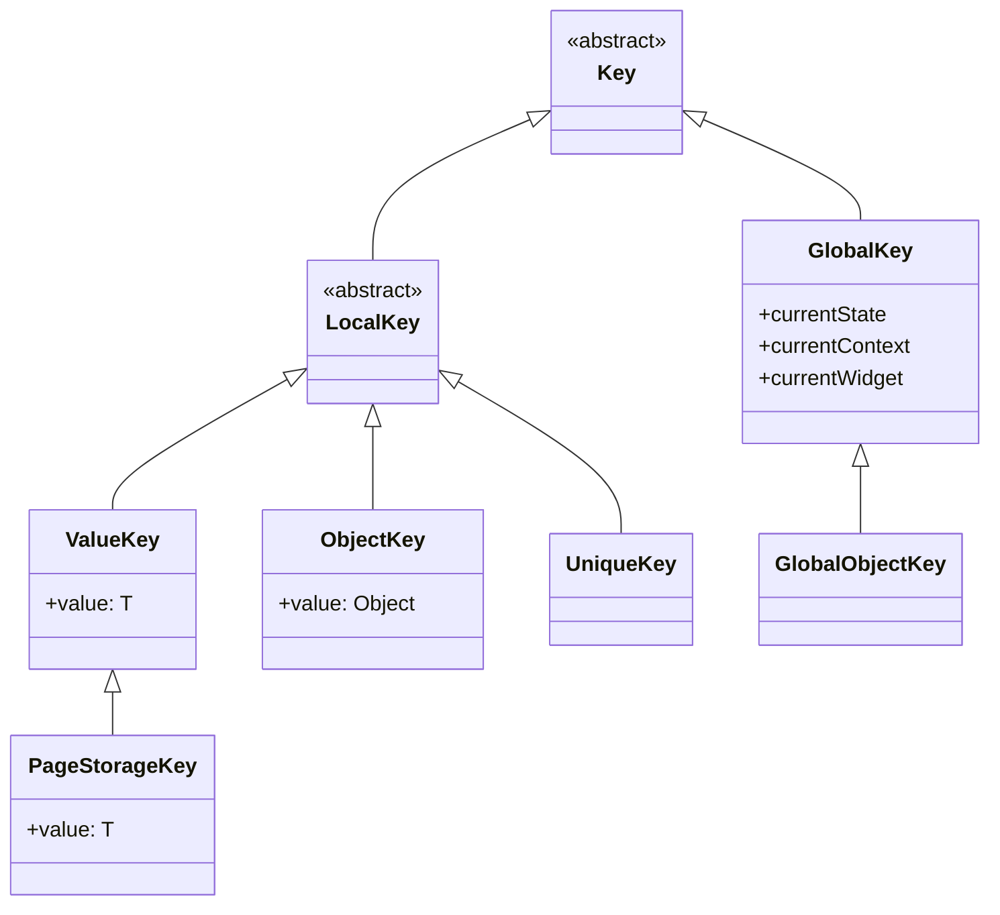

# Flutter Keys

> **Official Flutter Documentation & Resources:**
> - [Flutter API Reference: `Key` class](https://api.flutter.dev/flutter/foundation/Key-class.html)
> - [Flutter API Reference: `GlobalKey` class](https://api.flutter.dev/flutter/widgets/GlobalKey-class.html)
> - [Flutter Official Guide: When to Use Keys (YouTube)](https://www.youtube.com/watch?v=kn0EOS-ZiIc)

---

## Overview

In Flutter, **`Key`** objects act as identifiers for `Widget`s, `Element`s, and `SemanticsNode`s. They tell Flutter's reconciliation algorithm how to match existing elements in the element tree with updated widgets in the widget tree.

Flutter decides whether to update or replace an element using:
```dart
static bool canUpdate(Widget oldWidget, Widget newWidget) {
  return oldWidget.runtimeType == newWidget.runtimeType &&
         oldWidget.key == newWidget.key;
}
```

Without keys, Flutter matches widgets purely by **runtime type and order**. When stateful widgets move, reorder, or get removed, keys ensure that the internal `State` stays attached to the correct widget.

---

## Key Class Hierarchy



---

## Types of Keys and When to Use Them

### 1. `ValueKey<T>`
Identifies a widget by a primitive or value-equal object (uses `operator ==`).

* **Best For:** Lists with unique string/integer identifiers, database IDs.
* **Example:**
```dart
ListView.builder(
  itemCount: items.length,
  itemBuilder: (context, index) {
    final item = items[index];
    return TodoTile(
      key: ValueKey(item.id), // Preserves state based on unique ID
      todo: item,
    );
  },
);
```

---

### 2. `ObjectKey`
Identifies a widget by object instance identity (uses `identical()` / object reference).

* **Best For:** When two objects might have equal field values (`==`), but represent different object instances in memory.
* **Example:**
```dart
ObjectKey(userSession)
```

---

### 3. `UniqueKey`
Generates a globally unique key every time it is constructed.

* **Best For:** Forcing a widget to completely rebuild and discard its old state (e.g., restarting an animation, resetting an image/video player).
* **Important:** Must **not** be instantiated directly in `build()` unless intentional teardown is desired on every frame.
* **Example:**
```dart
// Force complete reload of a video player
VideoPlayerWidget(
  key: UniqueKey(),
  url: videoUrl,
)
```

---

### 4. `PageStorageKey<T>`
A specialized `ValueKey` that saves and restores widget state (like scroll offset) in `PageStorage` even when the widget is scrolled offscreen or when switching tabs.

* **Best For:** `ListView`, `GridView`, or `TabBarView` to preserve scroll positions across tab navigation.
* **Example:**
```dart
TabBarView(
  children: [
    ListView.builder(
      key: const PageStorageKey<String>('feed_tab_list'),
      itemCount: 100,
      itemBuilder: (context, index) => ListTile(title: Text('Post $index')),
    ),
    ListView.builder(
      key: const PageStorageKey<String>('profile_tab_list'),
      itemCount: 50,
      itemBuilder: (context, index) => ListTile(title: Text('Profile $index')),
    ),
  ],
)
```

---

### 5. `GlobalKey<T extends State<StatefulWidget>>`
A globally unique key across the entire application. It provides direct access to the widget's `State`, `BuildContext`, and `RenderObject`, and allows **reparenting** widgets across different subtrees without losing state.

* **Best For:**
  1. Validating and saving forms (`GlobalKey<FormState>`).
  2. Accessing RenderBox dimensions/positions.
  3. Navigating without BuildContext (`GlobalKey<NavigatorState>`).
* **Warning:** GlobalKeys are expensive to maintain. Use them sparingly.
* **Example (Form Validation):**
```dart
class MyForm extends StatefulWidget {
  const MyForm({super.key});

  @override
  State<MyForm> createState() => _MyFormState();
}

class _MyFormState extends State<MyForm> {
  final _formKey = GlobalKey<FormState>();

  void _submit() {
    if (_formKey.currentState?.validate() ?? false) {
      _formKey.currentState?.save();
      // Proceed with submit
    }
  }

  @override
  Widget build(BuildContext context) {
    return Form(
      key: _formKey,
      child: Column(
        children: [
          TextFormField(
            validator: (val) => val == null || val.isEmpty ? 'Required' : null,
          ),
          ElevatedButton(
            onPressed: _submit,
            child: const Text('Submit'),
          ),
        ],
      ),
    );
  }
}
```

---

## Comparison Matrix

| Key Type | Scope | Equality Mechanism | Primary Use Case | Performance Overhead |
| :--- | :--- | :--- | :--- | :--- |
| **`ValueKey<T>`** | Local to Parent | Value equality (`==`) | List items, reordering, items with distinct IDs | Low |
| **`ObjectKey`** | Local to Parent | Instance identity (`identical`) | Distinct object instances | Low |
| **`UniqueKey`** | Local to Parent | Unique per instance | Force re-creation / reset widget state | Low |
| **`PageStorageKey`** | Local / Storage | Value equality (`==`) | Preserving scroll positions across tabs | Low |
| **`GlobalKey`** | Global (Whole App) | Global identity | Form validation, reparenting, accessing State | High |

---

## Common Anti-Patterns and Mistakes

### 1. Creating Keys inside `build()`
**Wrong:**
```dart
@override
Widget build(BuildContext context) {
  // ❌ WRONG: Creates a new key on every rebuild! Destroys state on every frame.
  return MyStatefulWidget(key: UniqueKey());
}
```
**Right:**
```dart
// ✅ RIGHT: Maintain stable key or define as field in State
final _widgetKey = UniqueKey();
```

### 2. Missing Keys in Reorderable or Dismissible Lists
**Wrong:**
```dart
// ❌ WRONG: Checkbox state or input focus will jump to incorrect items after reordering.
ReorderableListView(
  children: items.map((item) => TodoItemTile(item: item)).toList(),
)
```
**Right:**
```dart
// ✅ RIGHT: Key matches the underlying data entity
ReorderableListView(
  children: items.map((item) => TodoItemTile(key: ValueKey(item.id), item: item)).toList(),
)
```

### 3. Duplicate GlobalKey in Tree
**Error:** `Duplicate GlobalKey detected in widget tree`
* A `GlobalKey` can only be mounted to **one** widget in the element tree at a time.
* Ensure you do not reuse the same `GlobalKey` instance across multiple list items.

---

## Live Code Reference

See the interactive sample in the codebase:
- [lib/samples/beginner/keys_example.dart](file:///Users/dinakarmaurya/Documents/Personal/flutter_riverpod_template/lib/samples/beginner/keys_example.dart)
