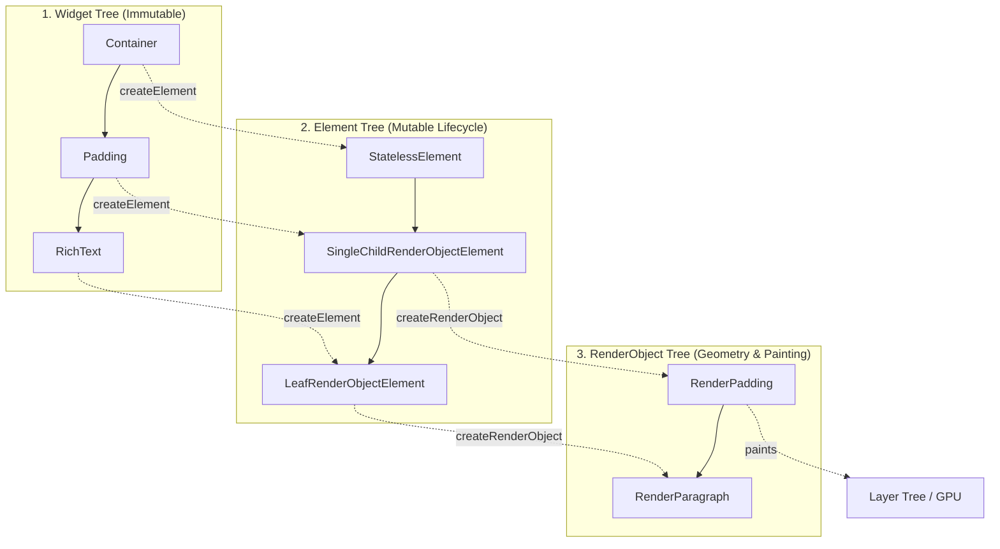
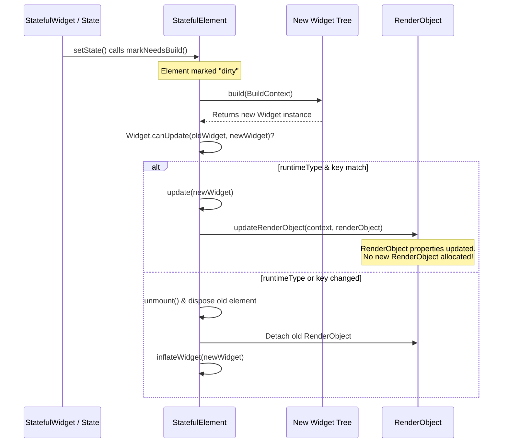

# The Three Trees in Flutter (Widget, Element, RenderObject)

> **Official Flutter Documentation:**
> - [Flutter Architectural Overview: From Widget to Render Object](https://docs.flutter.dev/resources/architectural-overview#from-widget-to-render-object)
> - [Flutter API Reference: `Element` class](https://api.flutter.dev/flutter/widgets/Element-class.html)
> - [Flutter API Reference: `RenderObject` class](https://api.flutter.dev/flutter/rendering/RenderObject-class.html)

---

## Overview

A fundamental architecture concept in Flutter is that what you write as a **Widget** is not what gets directly drawn to the screen. Flutter maintains **three parallel trees** to achieve maximum performance, fast rebuilds, and smooth 60/120fps animations:

1. **Widget Tree** (Declarative Blueprints / Configuration)
2. **Element Tree** (Lifecycle, State & Tree Manager / BuildContext)
3. **RenderObject Tree** (Layout, Painting & Hit Testing)

In addition to these three core trees, Flutter also generates a **Layer Tree** (GPU compositing) and a **Semantics Tree** (Accessibility).

---

## High-Level Architecture Diagram



---

## 1. The Widget Tree

### What is a Widget?
A widget is an **immutable, lightweight configuration** (a blueprint) describing how the UI should look.

* **Lifetime:** Extremely short. Widgets are created, destroyed, and rebuilt rapidly without memory overhead.
* **Mutability:** **Immutable** (`@immutable`). All properties must be `final`.
* **Cost:** Very cheap to create in memory.

### Widget Categories
* **Component Widgets:** Widgets that compose other widgets (e.g., `StatelessWidget`, `StatefulWidget`, `InheritedWidget`). They do **not** draw directly.
* **RenderObject Widgets:** Widgets that create a `RenderObject` to actually draw pixels (e.g., `Padding`, `Opacity`, `ColoredBox`, `RichText`, `Flex`).

---

## 2. The Element Tree

### What is an Element?
An `Element` is the **instantiated lifecycle manager** that represents a widget at a specific location in the tree.

* **Key Fact:** **`BuildContext` IS the `Element`!** `BuildContext` is an abstract interface implemented by the `Element` class.
* **Lifetime:** Long-lived. Elements survive across widget rebuilds.
* **Mutability:** **Mutable**. Holds references to the current widget, its parent, children, state, and render objects.
* **Role:** Orchestrates widget updates, holds `State` objects for `StatefulWidget`, and determines when the `RenderObject` needs to be repainted or resized.

### Element Hierarchy
```
Element
 ├── ComponentElement (Does not host a RenderObject)
 │    ├── StatelessElement (Hosts StatelessWidget)
 │    ├── StatefulElement (Hosts StatefulWidget + State)
 │    └── InheritedElement (Hosts InheritedWidget)
 └── RenderObjectElement (Hosts a RenderObject)
      ├── LeafRenderObjectElement (No children, e.g. RichText)
      ├── SingleChildRenderObjectElement (One child, e.g. Padding)
      └── MultiChildRenderObjectElement (Multiple children, e.g. Flex / Column)
```

---

## 3. The RenderObject Tree

### What is a RenderObject?
A `RenderObject` is the heavy engine object responsible for the actual **rendering pipeline**:

1. **Layout:** Computes size and constraints.
2. **Painting:** Draws visual primitives to the Canvas.
3. **Hit-Testing:** Detects touch/pointer events.

* **Lifetime:** Persistent. Expensive to instantiate, so Flutter reuses `RenderObject` instances as much as possible.
* **Coordinate System:** Most 2D UI elements use `RenderBox` (Cartesian coordinate system with `BoxConstraints`). Scrolling lists use `RenderSliver`.
* **Layout Rule:** **"Constraints go down, Sizes go up, Parent sets position."**

---

## 4. Other Supporting Trees

### A. The Layer Tree (Compositing)
When `RenderObject`s paint, they record draw commands onto `Layer`s (e.g., `TransformLayer`, `OpacityLayer`, `OffsetLayer`, `PictureLayer`).
* The Flutter engine sends the Layer Tree to the GPU compositor (Impeller / Skia).
* Using **`RepaintBoundary`** creates an isolated Layer so heavy subtrees can be redrawn without repainting the rest of the screen.

### B. The Semantics Tree (Accessibility)
Generated for screen readers (VoiceOver on iOS, TalkBack on Android). It contains labels, hints, actions, and accessibility nodes corresponding to UI widgets.

---

## 5. What Happens During a `setState()` Rebuild?



---

## Comparison Matrix

| Property | Widget Tree | Element Tree | RenderObject Tree |
| :--- | :--- | :--- | :--- |
| **Primary Purpose** | Declarative UI configuration | Lifecycle & state coordination | Layout, painting & hit testing |
| **Mutability** | **Immutable** (`final` fields) | **Mutable** | **Mutable** |
| **Instantiation Cost**| Very cheap (disposable) | Medium (managed) | Expensive (heavy GPU/layout node) |
| **Lifetime** | Short (recreated on rebuild) | Long (persists across rebuilds)| Long (reused across updates) |
| **User Code Interaction** | Direct (`build()` methods) | Indirect (`BuildContext`, `State`) | Low-level (`CustomPainter`, RenderBox) |
| **Key Method** | `createElement()` | `mount()`, `update()`, `markNeedsBuild()` | `layout()`, `paint()`, `hitTest()` |

---

## Key Takeaways for Senior Engineers

1. **Rebuilds are cheap, repaints are expensive:** Recreating widgets during `build()` is virtually free in Dart. Performance problems occur when `RenderObject`s are forced to perform redundant layouts (`markNeedsLayout()`) or repaints (`markNeedsPaint()`).
2. **`BuildContext` is the Element:** When you call `Theme.of(context)` or `Navigator.of(context)`, you are asking the Element to walk up its parent chain in the Element tree.
3. **Keys control Element matching:** When elements match by `Widget.canUpdate(oldWidget, newWidget)` (`runtimeType == oldWidget.runtimeType && key == oldWidget.key`), Flutter preserves the `Element` and `RenderObject`, updating only their configuration.

---

## Related Documentation
- [Flutter Keys](keys.md)
- [BuildContext Guide](buildcontext.md)
- [Engine & Rendering Internals](../advanced/engine_and_rendering_internals.md)
