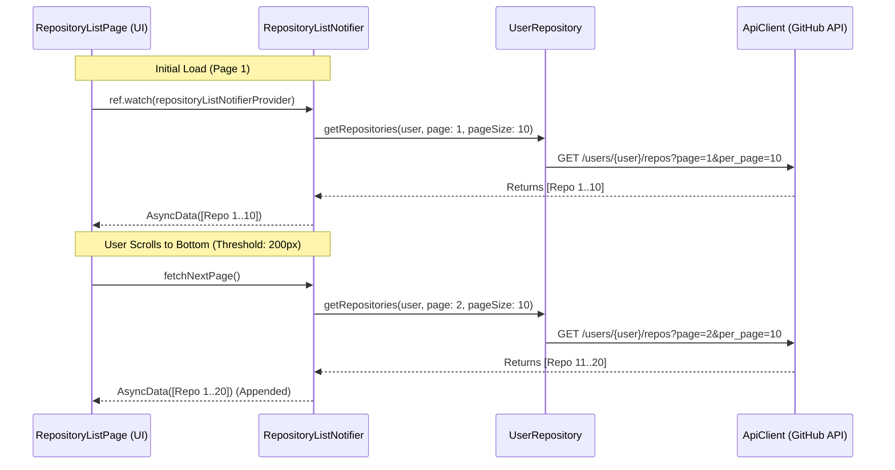

# Pagination & Infinite Scrolling Guide (Riverpod 3.0)

> **Official Documentation & Resources:**
> - [Flutter Cookbook: Work with long lists](https://docs.flutter.dev/cookbook/lists/long-lists)
> - [Riverpod Official Documentation](https://riverpod.dev/docs/introduction/getting_started)

---

## Overview

Pagination breaks large datasets into manageable chunks (pages) to reduce initial network payloads, decrease memory consumption, and ensure smooth UI scrolling.

In this template architecture, pagination connects four layers:
1. **API Client Layer (Retrofit / Dio):** Passes `page` and `per_page` query parameters.
2. **Repository Layer:** Abstract data source contracts and implementations.
3. **Notifier Layer (Riverpod `AsyncNotifier`):** Manages pagination state, page tracking, and appending new items.
4. **UI Presentation Layer:** Listens to scroll threshold and triggers next page loads.

---

## Architecture Flow



---

## Step-by-Step Implementation Guide

### 1. API Client Layer ([api_client.dart](../../../../lib/data/remote/api/client/api_client.dart))
Update the Retrofit interface to accept both `page` and `per_page`:

```dart
@GET("${ApiPath.users}/{username}/repos")
Future<List<RepositoryListModel>> getRepositories(
  @Path("username") String username,
  @Query("page") int page,
  @Query("per_page") int pageSize,
);
```

---

### 2. Repository Layer ([user_repository.dart](../../../../lib/data/remote/api/providers/user/user_repository.dart))
Update the abstract interface and concrete implementation:

```dart
abstract class UserRepository {
  Future<List<RepositoryListModel>> getRepositories(
    String userName,
    int page,
    int pageSize,
  );
}

class UserRepositoryImpl implements UserRepository {
  UserRepositoryImpl(this.apiClient);
  final ApiClient apiClient;

  @override
  Future<List<RepositoryListModel>> getRepositories(
    String userName,
    int page,
    int pageSize,
  ) => apiClient.getRepositories(userName, page, pageSize);
}
```

---

### 3. Notifier Layer ([repository_list_notifier_provider.dart](../../../../lib/feature/repository_list/providers/repository_list_notifier_provider.dart))
Implement pagination state management in `AsyncNotifier`:

```dart
import 'package:flutter_riverpod_template/data/remote/api/providers/user/user_repository_provider.dart';
import 'package:flutter_riverpod_template/feature/repository_list/models/repository_list_model.dart';
import 'package:flutter_riverpod_template/feature/shared/providers/user_session_provider.dart';
import 'package:riverpod_annotation/riverpod_annotation.dart';

part 'repository_list_notifier_provider.g.dart';

@riverpod
class RepositoryListNotifier extends _$RepositoryListNotifier {
  int _currentPage = 1;
  bool _hasMore = true;
  bool _isLoadingMore = false;
  static const int pageSize = 10;

  bool get hasMore => _hasMore;
  bool get isLoadingMore => _isLoadingMore;

  @override
  Future<List<RepositoryListModel>> build() async {
    _currentPage = 1;
    _hasMore = true;
    _isLoadingMore = false;

    final userSession = ref.watch(userSessionProvider);
    final userName = userSession.value?.username ?? 'google';

    return await ref
        .read(userRepositoryProvider)
        .getRepositories(userName, _currentPage, pageSize);
  }

  /// Fetches subsequent pages and appends results to state
  Future<void> fetchNextPage() async {
    if (_isLoadingMore || !_hasMore) return;
    _isLoadingMore = true;

    final userName = ref.read(userSessionProvider).value?.username ?? 'google';
    final nextPage = _currentPage + 1;

    try {
      final newItems = await ref
          .read(userRepositoryProvider)
          .getRepositories(userName, nextPage, pageSize);

      if (newItems.isEmpty || newItems.length < pageSize) {
        _hasMore = false;
      }
      
      _currentPage = nextPage;
      state = AsyncData([...state.value ?? [], ...newItems]);
    } catch (e, st) {
      // Keep existing list on error, or update UI state
      state = AsyncError(e, st);
    } finally {
      _isLoadingMore = false;
    }
  }
}
```

---

### 4. Presentation / UI Layer ([repository_list_page.dart](../../../../lib/feature/repository_list/views/repository_list_page.dart))
Wrap the list in a `NotificationListener<ScrollNotification>`:

```dart
NotificationListener<ScrollNotification>(
  onNotification: (ScrollNotification scrollInfo) {
    if (scrollInfo.metrics.pixels >= scrollInfo.metrics.maxScrollExtent - 200) {
      ref.read(repositoryListNotifierProvider.notifier).fetchNextPage();
    }
    return false;
  },
  child: CustomScrollView(
    slivers: [
      SharedSliverAppBar(title: widget.title),
      _buildListRootView(),
      if (ref.watch(repositoryListNotifierProvider.notifier).isLoadingMore)
        const SliverToBoxAdapter(
          child: Padding(
            padding: EdgeInsets.all(16.0),
            child: Center(child: CircularProgressIndicator.adaptive()),
          ),
        ),
    ],
  ),
)
```

---

## Best Practice Checklist

| Rule | Why it matters |
| :--- | :--- |
| **Prevent Concurrent Calls (`_isLoadingMore`)** | Rapid scrolling triggers multiple notifications. A lock prevents fetching the same page twice. |
| **End-of-List Flag (`_hasMore`)** | If an API returns fewer items than `pageSize`, disable future network requests. |
| **Threshold Fetching (200px before bottom)** | Initiates data fetch before the user hits the bottom, providing a seamless scroll experience. |
| **Pull-to-Refresh (`ref.invalidate`)** | Invalidate the provider on refresh to reset `_currentPage = 1` and reload from scratch. |

---

## Related Documentation
- [Riverpod 3.0 Guide](state_management_and_riverpod.md)
- [Networking & Persistence](networking_and_persistence.md)
- [Architecture Guide](../../ARCHITECTURE.md)
